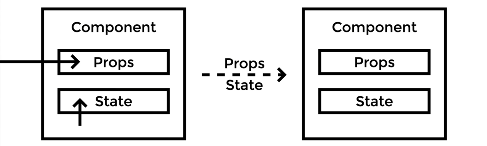
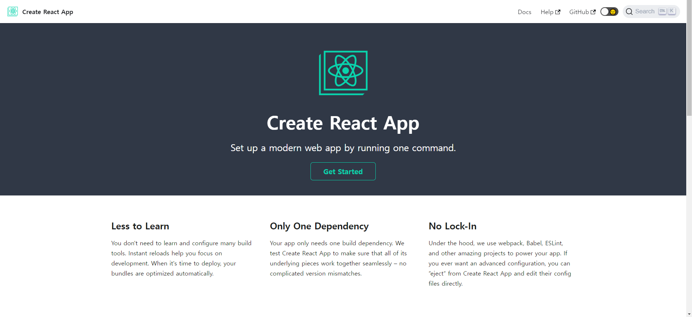

# :sunflower: React-study

:open_file_folder: ch1. React Getting Started

<details>
<summary> :pencil: 01. React Concept  </summary>
<div markdown="1">

## 01. React Concept

### :pushpin: React 란 무엇일까?

> React 는 사용자 인터페이스(User Interface)를 만들기 위한 Javascript 라이브러리이다. <br>
> React 를 이해하기 위해 DOM(Document Object Model)을 알아야한다. <br>
> DOM 은 자바스크립트에서 HTML에 접근할 수 있도록 요소들을 객체화하여 사용할 수 있도록 한다.<br>
> DOM은 HTML이나 XML 문서의 interface 이다.

### :pushpin: Virtual DOM

가상 DOM은 DOM이 생성되기 전, 이전 상태 값과 수정사항을 비교하여 달라진 부분만 DOM 에게 한번에 전달하여 한번만 렌더링을 진행한다.

### :pushpin: Why virtual DOM?

- DOM 을 직접 제어하는 경우
  - 바뀐 부분만 정확히 바꿔야 한다.
- DOM을 직접 제어하지 않는 경우
  - 가상의 돔 트리를 사용해서,
  - 이전 상태를 비교하여,
  - 바뀐 부분을 찾아내서 자동으로 바꾼다.

### :pushpin: 컴포넌트

- React는 UI를 여러 컴포넌트로 만들어 사용하므로 재사용성이 높다.
- 프로젝트가 복잡해지더라도 코드 유지보수 및 관리에 용이하다.
</div>
</details>

<details>
<summary> :pencil: 02. 개발 환경 체크  </summary>
<div markdown="1">

## 필요한 개발환경

- Node.js
  - installer
  - nvm
- Browser (Chrome)
- Git
- VSCode
</div>
</details>

<details>
<summary> :pencil: 03. React 라이브러리(1)  </summary>
<div markdown="1">

## 리액트가 하는 일

리액트의 핵심 모듈 2개로 리액트가 하는 일 알아보기

### :one: 리액트 컴포넌트 => HTMLElement 연결하기

"만들어진 리액트 컴포넌트"를 실제 HTMLElement에 연결할 때 ReactDOM 라이브러리를 이용한다.

```js
import ReactDOM from "react-dom";
```

### :two: 리액트 컴포넌트 만들기

```js
import React from "react";
```

## 파일 생성 예제

### :one: 프로젝트 시작하기

```
$ npm init -y
$ npx serve
```

### :two: index.html 파일 생성

[CDN 링크](https://reactjs.org/docs/cdn-links.html)
위 사이트에 접속하여 링크를 body 부분에 추가해준다

- index.html

```html
<body>
  <script
    crossorigin
    src="https://unpkg.com/react@18/umd/react.development.js"
  ></script>
  <script
    crossorigin
    src="https://unpkg.com/react-dom@18/umd/react-dom.development.js"
  ></script>
</body>
```

</div>
</details>

:open_file_folder: ch2. React Component

<details>
<summary> :pencil: React Component 만드는법  </summary>
<div markdown="1">

## React Component 만드는법 - 2가지

### class 컴포넌트

```js
import React from "react";

// 정의
class ClassComponent extends React.Component {
  render() {
    // 항상 return 해주어야 한다.
    return <div>Hello</div>;
  }
}

// 사용
ReactDom.render(<ClassComponent />, document.querySelector("#root"));
```

### function 컴포넌트

```js
import React from "react";

// 정의 1
function FunctionComponent() {
  return <div>Hello</div>;
}
// 사용
ReactDOM.render(<FunctionComponent />, document.querySelector("#root"));

// 정의 2
const FunctionComponent = () => <div>Hello</div>;

// 사용
ReactDOM.render(<FunctionComponent />, document.querySelector("#root"));
```

</div>
</details>

<details>
<summary> :pencil: React.createElemet  </summary>
<div markdown="1">

## React.createElemet

사용형태

```js
React.createElemet(
  type, // 태그 이름 문자열 | 리액트 컴포넌트 | React.Fragment
  [props], // 리액트 컴포넌트에 넣어주는 데이터 객체
  [...children] // 자식으로 넣어주는 요소들
);
```

:one: 태그 이름 문자열 type

```html
<div id="root"></div>
<script type="text/javascript">
  ReactDOM.render(
    React.createElement("h1", null, `type 이 "태그 이름 문자열" 입니다.`),
    document.querySelector("#root")
  );
</script>
```

:two: 리액트 컴포넌트 type

```html
<div id="root"></div>
<script type="text/javascript">
  const Component = () => {
    return React.createElement("p", null, `type이 "React 컴포넌트" 입니다.`);
  };

  // <Component></Component> => <Component /> => <p>type이 "React 컴포넌트" 입니다.</p>
  ReactDOM.render(
    React.createElement(Component, null, null),
    document.querySelector("#root")
  );
</script>
```

:three: React.Fragment

```html
<div id="root"></div>
<script type="text/javascript">
  ReactDOM.render(
    React.createElement(
      React.Fragment,
      null,
      `type 이 "React Fragment" 입니다.`
    ),
    document.querySelector("#root")
  );
</script>
```

</div>
</details>

<details>
<summary> :pencil: JSX  </summary>
<div markdown="1">

## JSX

복잡한 코드를 순수하게 실행할 수 있는 자바스크립트로 변환하는 과정이 필요하다.<br>
JSX 문법으로 작성된 코드는 순수한 JavaScript로 컴파일 하여 사용한다. <br>
이는 `babel` 에 의해 진행된다.
[babel 사이트](https://babeljs.io/)
아래의 코드를 추가해주면 자동으로 변환한다.

```html
<script src="https://unpkg.com/@babel/standalone/babel.min.js"></script>

<div id="root"></div>
<script type="text/babel">
  ReactDOM.render(
    <div>
      <div>
        <h1>주제</h1>
        <ul>
          <li>React</li>
          <li>Vue</li>
        </ul>
      </div>
    </div>,
    document.querySelector("#root")
  );
</script>
```

### JSX를 사용하는 이유

- React.createElement VS JSX
  - JSX가 가독성이 엄청 좋음
- babel 과 같은 컴파일 과정에서 문법적 오류를 인지하기 쉬움

### JSX 문법

- 최상위 요소가 하나여야 합니다.
- 최상위 요소 리턴하는 경우, () 로 감싸야 합니다.
- 자식들을 바로 랜더링하고 싶으면, <>자식들</>를 사용합니다. => Fragment
- 자바스크립트 표현식을 사용하려면, {표현식} 를 이용합니다.
- if 문은 사용할 수 없습니다.
  - 삼항 연산자 혹은 &&를 사용합니다.
- style 을 이용해 인라인 스타일링이 가능합니다.
- class 대신 className 을 사용해 class 를 적용할 수 있습니다.
</div>
</details>

<details>
<summary> :pencil: Props와 State  </summary>
<div markdown="1">

## Props와 State

- Props는 컴포넌트 외부에서 컴포넌트에게 주는 데이터 입니다.
- State 는 컴포넌트 내부에서 변경할 수 있는 데이터 입니다.
- 둗다 변경이 발생하면, 랜더가 다시 일어날 수 있습니다.

## Render 함수

Props 와 State 를 바탕으로 컴포넌트를 그립니다. <br>
그리고 Props와 state가 변경되면, 컴포넌트를 다시 그립니다. <br>
컴포넌트를 그리는 방법을 기술하는 함수가 랜더합수 입니다.


## Props

### :pushpin: 코드로 살펴보기

:one: function Component 이용하기

```html
<div id="root"></div>
<script type="text/babel">
  console.log(React);
  console.log(ReactDOM);

  // {message: '안녕하세요!!!'}
  function Component(props) {
    return (
      <div>
        <h1>{props.message} 이것은 함수로 만든 컴포넌트 입니다.</h1>
      </div>
    );
    // 출력: 안녕하세요!!! 이것은 함수로 만든 컴포넌트 입니다.
  }

  ReactDOM.render(
    <Component message="안녕하세요!!!" />,
    document.querySelector("#root")
  );
</script>
```

:two: class Component 이용하기

```html
<div id="root"></div>
<script type="text/babel">
  console.log(React);
  console.log(ReactDOM);

  class Component extends React.Component {
    render() {
      return (
        <div>
          <h1>{this.props.message} 이것은 클래스로 만든 컴포넌트 입니다.</h1>
        </div>
      );
    }
  }

  ReactDOM.render(
    <Component message="안녕하세요!!" />,
    document.querySelector("#root")
  );
</script>
```

- 기본값 지정해보기 1

```html
<div id="root"></div>
<script type="text/babel">
  console.log(React);
  console.log(ReactDOM);

  class Component extends React.Component {
    render() {
      return (
        <div>
          <h1>{this.props.message} 이것은 클래스로 만든 컴포넌트 입니다.</h1>
        </div>
      );
    }
  }

  Component.defaultProps = {
    message: "기본값",
  };

  ReactDOM.render(<Component />, document.querySelector("#root"));
</script>
```

- 기본값 지정해보기 2

```html
<div id="root"></div>
<script type="text/babel">
  console.log(React);
  console.log(ReactDOM);

  class Component extends React.Component {
    render() {
      return (
        <div>
          <h1>{this.props.message} 이것은 클래스로 만든 컴포넌트 입니다.</h1>
        </div>
      );
    }

    static defaultProps = {
      message: "기본값",
    };
  }

  ReactDOM.render(<Component />, document.querySelector("#root"));
</script>
```

함수에서도 사용 가능하다.

## State

- State 정의 방법 1: 항상 객체 형태로 선언해야함

```html
<div id="root"></div>
<script type="text/babel">
  console.log(React);
  console.log(ReactDOM);

  class Component extends React.Component {
    state = {
      count: 0,
    };
    render() {
      return (
        <div>
          <h1>{this.props.message} 이것은 클래스로 만든 컴포넌트 입니다.</h1>
          <p>{this.state.count}</p>
        </div>
      );
    }

    componentDidMount() {
      // 메서드 재정의
      setTimeout(() => {
        this.setState({
          count: this.state.count + 1,
        });
      }, 1000);
    }

    static defaultProps = {
      message: "기본값",
    };
  }

  ReactDOM.render(
    <Component message="기본값 아님" />,
    document.querySelector("#root")
  );
</script>
```

- State 정의 방법 2

```html
<div id="root"></div>
<script type="text/babel">
  console.log(React);
  console.log(ReactDOM);

  class Component extends React.Component {
    constructor(props) {
      super(props);

      // state 초기화
      this.state = { count: 0 };
    }

    render() {
      return (
        <div>
          <h1>{this.props.message} 이것은 클래스로 만든 컴포넌트 입니다.</h1>
          <p>{this.state.count}</p>
        </div>
      );
    }

    componentDidMount() {
      // 메서드 재정의
      setTimeout(() => {
        // this.setState({
        //     count: this.state.count + 1,
        // });
        this.setState((previousState) => {
          const newState = { count: previousState.count + 1 };
          return newState;
        });
      }, 1000);
    }

    static defaultProps = {
      message: "기본값",
    };
  }

  ReactDOM.render(
    <Component message="기본값 아님" />,
    document.querySelector("#root")
  );
</script>
```

</div>
</details>

<details>
<summary> :pencil: Event Handling  </summary>
<div markdown="1">

## Event Handling

- HTML DOM 에 클릭하면 이벤트가 발생하고, 발생하면 그에 맞는 병경이 일어나도록 해야합니다.
- JSX 에 이벤트를 설정할 수 있습니다.

```js
class Comp extends React.Component {
  render() {
    return (
      <div>
        <button
          onClick={() => {
            console.log("clicked");
          }}
        ></button>
      </div>
    );
  }
}
```

- camelCase 로만 사용할 수 있습니다.
  - onClick, onMouseEnter
- 이벤트에 연결된 자바스트립트 코드는 함수입니다.
  - 이벤트={함수} 와 같이 사용합니다.
- 실제 DOM 요소들에만 사용 가능합니다.
  - 리액트 컴포넌트에 사용하면, 그냥 props로 전달합니다.

### :pushpin: 코드 구현

- 함수로 구현

```html
<script type="text/babel">
  function Component() {
    return (
      <div>
        <button
          onClick={() => {
            console.log("clicked");
          }}
        >
          클릭
        </button>
      </div>
    );
  }

  ReactCOM.render(<Component />, document.querySelector("#root"));
</script>
```

- class로 구현

```html
<script type="text/babel">
  class Component extends React.Component {
    state = {
      count: 0,
    };
    render() {
      return (
        <div>
          <p>{this.state.count}</p>
          <button
            // onMouseEnter
            onClick={() => {
              console.log("clicked");
              this.setState((state) => ({
                ...state,
                count: state.count + 1,
              }));
            }}
          >
            클릭
          </button>
        </div>
      );
    }
  }

  ReactCOM.render(<Component />, document.querySelector("#root"));
</script>
```

- 위 코드 `method` 로 분리하기 1

```html
<script type="text/babel">
  class Component extends React.Component {
    state = {
      count: 0,
    };
    constructor(props) {
      super(props);

      this.click = this.click.bind(this);
    }
    render() {
      return (
        <div>
          <p>{this.state.count}</p>
          <button onClick={this.click}>클릭</button>
        </div>
      );
    }
    click() {
      console.log("clicked");
      this.setState((state) => ({
        ...state,
        count: state.count + 1,
      }));
    }
  }

  ReactCOM.render(<Component />, document.querySelector("#root"));
</script>
```

- 위 코드 `method` 로 분리하기 2

```html
<script type="text/babel">
  class Component extends React.Component {
    state = {
      count: 0,
    };
    render() {
      return (
        <div>
          <p>{this.state.count}</p>
          <button onClick={this.click}>클릭</button>
        </div>
      );
    }
    click = () => {
      console.log("clicked");
      this.setState((state) => ({
        ...state,
        count: state.count + 1,
      }));
    };
  }

  ReactCOM.render(<Component />, document.querySelector("#root"));
</script>
```

</div>
</details>

<details>
<summary> :pencil: Component Lifecycle  </summary>
<div markdown="1">

## Component Lifecycle

리액트 컴포넌트는 탄생부터 죽음까지 여러지점에서 개발자가 작업이 가능하도록 메서드를 오버라이딩 할 수 있게 해준다.

### :one: Component 생성 및 마운트

- constructor
- componentWillMount
- render(최초 렌더)
- componentDidMount

```html
<script type="text/babel">
  class App extends React.component {
    state = {
      age: 23,
    };
    constructor(props) {
      super(props);

      console.log("constructor", props);
    }
    render() {
      console.log("render");
      return (
        <div>
          <h2>
            Hello {this.props.name} - {this.state.age}
          </h2>
        </div>
      );
    }
    componentWillMount() {
      console.log("componentWillMount");
    }
    conmonentDidMount() {
      console.log("componentDidMount");

      setInterval(() => {
        console.log("setInterval");
        this.setState((state) => ({ ...state, age: state.age }));
      }, 1000);
    }
  }

  ReactDOM.render(<App name="Mark" />, document.querySelector("#root"));
</script>
```

### :two: Component props, state 변경

- componentWillReceiveProps
  - props 를 새로 지정했을 때 바로 호출됩니다.
  - 여기는 state 의 변경에 반응하지 않습니다.
    - 여기서 props 의 값에 따라 state 를 변경해야 한다면,
      - setState 를 이용해 state 를 변경합니다.
      - 그러면 다음 이벤트로 각각 가는 것이 아니라 한번에 변경됩니다.
- shouldComponentUpdate
  - props 만 변경되어도 실행됩니다.
  - state 만 변경되어도 실행됩니다.
  - props & state 둘다 변경되어도 실행됩니다.
  - newProps 와 new State 를 인자로 해서 호출합니다.
  - return type 이 boolean 입니다.
    - true 면 render
    - false 면 render 가 호출되지 않습니다.
    - 이 함수를 구현하지 않으면, 디폴트는 true 입니다.
- componentWillUpdate
  - 컴포넌트가 재 렌더링 되기 직접에 불립니다.
  - 여기선 setState 같은 것을 사용하면 안됩니다.
- <b>render</b>
- componentDidUpdate
  - 컴포넌트가 재 렌더링을 마치면 불립니다.

```html
<script type="text/babel">
  class App extends React.component {
    state = {
      age: 23,
    };
    interval = 0;
    constructor(props) {
      super(props);

      console.log("constructor", props);
    }
    render() {
      console.log("render");
      return (
        <div>
          <h2>
            Hello {this.props.name} - {this.state.age}
          </h2>
        </div>
      );
    }
    componentWillMount() {
      console.log("componentWillMount");
    }
    conmonentDidMount() {
      console.log("componentDidMount");

      this.interval = setInterval(() => {
        // console.log("setInterval");
        this.setState((state) => ({ ...state, age: state.age }));
      }, 1000);
    }
    componentWillReceiveProps() {
      console.log("componentWillReceiveProps", nextProps);
    }
    shouldComponentUpdate() {
      console.log("shouldComponentUpdate", nextProps, nextState);

      return true;

      // return 을 해주어야 한다.
      // return true; 함수가 끝나면 바로 render 할 준비를 한다.
      // return false; 다음 단계로 넘어가지 않기 때문에 render를 하지 않는다. 그러므로 false 를 해놓으면 효율적으로 render를 처리할 수 있다.
    }
    componentWillUpdate(nextProps, nextState) {
      console.log("componentWillUpdate", nextProps, nextState);
    }

    // render 가 시작
    componentDidUpdate(prevProps, prevState) {
      console.log("componentDidUpdate", prevProps, prevState);
    }

    componentWillUnmpunt() {
      clearInterval(this.interval);
    }
  }

  ReactDOM.render(<App name="Mark" />, document.querySelector("#root"));
</script>
```

### :three: Component 언마운트

- componentWillUnmpunt

</div>
</details>

<details>
<summary> :pencil: Component Lifecycle 변경 </summary>
<div markdown="1">

### :one: Component 생성 및 마운트

- construtcor
- ~~componentWillMound~~ => getDerivedStateFromProps
- render
- componentDidMount

### :two: Component props, state 변경

- ~~componentWillReceiveProps~~ => getDerivedStateFromProps
- shouldComponentUpdate
- render
- ~~componentWillUpdate~~ => getSnapshotBeforeUpdate
- componentDidUpdate

```html
<script type="text/babel">
  const i = 0;
  class Appp extends React.Component {
      state = { list: [] };

      render() {
          return (
              <div id="list" style={{height: 100, overflow: "scroll"}}>
                  {this.state.lsit.map((i) => {
                      return <div>{i}</div>
                  })}
              </div>
          );
      }

      componentDidMount() {
          setInterval(() => {
              this.setState((state) => ({
                  list: [..state.list, i++],
              }));
          }, 1000);
      }

      getSnapshotBeforUpdate(prevProps, prevState) {
          if(prevState.list.length === this.state.list.length) return null; // 차이가 있으면 저장할 필요 없음
          const list = document.querySelector('#list');
          return list.scrollHeight - list.scrollTop; // snap 샷으로 저장해줌
      }

      componentDidUpdate(prevProps, prevState, snapshot) {
          console.log(snapshot); // list.scrollHeight - list.scrollTop 결과값 출력
          if (snapshot === null) return;
          const list = document.querySelector('#list');
          list.scrollTop = list.scrollHeight - snapshot; // 마지막 내용이 업데이트 되면 스크롤이 자동으로 내려감
      }
  }

  ReactDOM.render(<App name="Mark" />, document.querySelector('#root'));
</script>
```

### :pushpin: component 에러 캐치

- componentDidCatch

```html
<script type="text/babel">
  const i = 0;
  class Appp extends React.Component {
    state = {
      hasError: false,
    };
    render() {
      if (this.state.hasError) {
        return <div>예상치 못한 에러가 발생했습니다.</div>;
      }
      return <WebService />;
    }

    // WebService 에서 에러가 발생하는 것을 알아차리는 곳
    componentDidCatch(error, info) {
      this.setState({ hasError: true });
    }
  }

  ReactDOM.render(<App name="Mark" />, document.querySelector("#root"));
</script>
```

</div>
</details>

# :sunflower: React-study

:open_file_folder: ch3. Creating React Project : 실제 현업에서 사용하는 프로젝트 제작하기

<details>
<summary> :pencil: 01. Create React App  </summary>
<div markdown="1">

## 사이트 접속하기

[CRA](https://create-react-app.dev)

- Facebook 의 오픈소스 이다.
- React 도 facebook 에서 시작했다.
- 그러므로 공식적인 tool 이라고 봐도 무방하다.
  

## 명령어 살펴보기

### npx

npm 5.2.0 이상부터 함께 설치된 커맨드라인 명령어

## 프로젝트 시작하기

### :one: 프로젝트 만들기

- node 기반의 프로젝트를 생성한다.

```
npx create-react-app 프로젝트 이름
```

```
npx create-react-app tic-tac-toe
```

### :two: 프로젝트 접속

- 프로젝트 생성 후 사이트로 확인하면 기본 세팅된 페이지가 나온다.

```
npm start
```


### :three:

작업을 다 끝냈다면 최종적으로 배포할 준비를 해야한다.<br>

### npm start

- react-scripts start
- Starting the development server...

### npm run build

- react-scripts build
- Creacting an optimized production build...

```
npm run build
```

이 코드를 사용하면 컴파일을 실행하게 된다. <br>
컴파일 후 새로운 파일을 만들어 작은 파일로 관리한다.<br>
생성된 파일을 실행하려면 아래의 코드를 사용하면 된다.<br>

### npm install server -g

- server 라는 패키지를 전역으로 설치합니다.
- server 명령어를 -s 옵션으로 build 폴더를 지정하여 실행합니다.
  - -s 옵션은 어떤 라우팅으로 요청해도 index.html 을 응답하도록 합니다.

```
npm install server -g
server -s build
```

```
npx serve -s build
```

개발 모드와 똑같은 결과로 사이트에 출력될 것이다.<br>
다만, 코드가 간단하게 작성되어 있다는 차이점이 있다.<br>
개발할 때 코드를 수정하면 자동으로 build 가 수정된다.<br>

### npm test

- react-scripts test
- Jest 를 통해 test code 를 실햅합니다.

```
npm test
```

creact-react-app 을 사용하지 않기 위해서는 아래의 코드를 comand 창에 입력한다.<br>

### npm run eject

- react-scripts eject

```
npm run eject
```

eject 를 이용하면, cra 로 만든 프로젝트에서 cra를 제거한다. <br>
이는 돌이킬 수 없기 때문에 결정하기 전에 신중해야 한다.<br>
보통 cra 내에서 해결이 안되는 설정을 추가해야할 때 한다.

- react-scripts 는 사라집니다.
- 드러내지 않고 cra 에 의해 사용되던 각종 패키지가 package.json 에 나타난다.
- Jest, Babel, ESLint 설정이 추가된다.
- 각종 설정 파일이 config 폴더에 생성된다.
</div>
</details>

<details>
<summary> :pencil: 02. ESLint  </summary>
<div markdown="1">

## ESLint

creact app 으로 설치하면 기본적으로 설치된다. <br>
ESLint 는 react 프로젝트에서만 사용하는 것이 아니라 모든 js 프로젝트에서 사용된다.

## ESLint test

### :one: 기본 개념

```
$ mkdir eslint-test
$ cd .\eslint-test\
$ npm init -y
$ npm i eslint -D // 라이브러리 설치
$ npx eslint --init // 설치된 eslint 초기화
```

.eslintrc.js 파일이 생기는 것을 확인할 수 있다.

- "rules" 부분에 추가하고자 하는 내용을 추가한다.
- 홈페이지에 확인하면 더 많은 기능이 있다.

```js
module.exports = {
  env: {
    browser: true,
    es2021: true,
  },
  extends: "eslint:recommended",
  overrides: [],
  parserOptions: {
    ecmaVersion: "latest",
  },
  rules: {
    semi: ["error", "always"], // 세미콜론을 안찍으면 문제가 생김
  },
};
```

위의 코드를 적고 제대로 동작하는지 확인하려면 아래의 코드를 실행한다.

```
npx eslint index.js
```

오류가 발생했을 때 코드를 고치고 싶다면 아래의 명령어를 사용하면 된다.

```
npx eslint index.js --fix
```

### :two: create react 로 설치된 프로젝트에서의 사용법

### :pushpin: package.json

- .eslintrc.js 파일의 항목들이 아래의 코드로 작성되어 들어간다.

```json
  "eslintConfig": {
    "extends": [
      "react-app",
      "react-app/jest"
    ]
  },
```

내용을 추가하고 싶은 경우 rules 를 추가해주면 된다.

```json
  "eslintConfig": {
    "extends": [
      "react-app",
      "react-app/jest"
    ],
    "rules": {
        "semi": ["error", "always"],
    }
  },
```

</div>
</details>

<details>
<summary> :pencil: 03. Prettier  </summary>
<div markdown="1">

## Prettier

<b>An opinionated code formatter</b><br>
Prettier 에서 불필요하거나, Prettier 와 충돌할 수 있는 모든 규칙은 끈다. <br>
이 구성은 규칙을 끄기만 하기 때문에 다른 설정과 함께 사용하는 것이 좋다.

## Prettier test

```
$ mkdir prettier-test
$ cd .\prettier-test\
$ npm init -y
$ npm i prettier -D
```

### :pushpin: index.js

```js
console.log("Hello");
```

### :pushpin: cmd

- 코드가 잘못된 경우 올바른 코드를 알려준다.

```
npx prettier index.js
// 결과: console.log("Hello");
```

- 아래의 코드를 실행하면 자동으로 변환해준다.

```
npx prettier index.js --write
```

</div>
</details>

<details>
<summary> :pencil: 04. husky  </summary>
<div markdown="1">

## husky

- Git hooks made easy

## husky test

### cmd

```
$ mkdir husky-test
$ cd .\husky-test\
$ npm init -y
$ git init
$ npm i husky -D
$ npx husky install
```

### package.json

아래의 코드와 같이 수정하기

```json
{
  "name": "husky-test",
  "version": "1.0.0",
  "description": "",
  "main": "index.js",
  "scripts": {
    "prepare": "husky install",
    "test": "echo \"Error: no test specified\" && exit 1"
  },
  "keywords": [],
  "author": "",
  "license": "ISC",
  "devDependencies": {
    "husky": "^8.0.1"
  }
}
```

### cmd

```
$ npx husky add .husky/pre-commit "npm test"
```

이렇듯 husky 를 사용하면 commit 이 되기 직전에 모든 코드를 살펴볼 수 있다.

</div>
</details>

<details>
<summary> :pencil: 05. lint-staged - Run linters on git staged files </summary>
<div markdown="1">

## lint-staged

### cmd

```
$ cd tic-tac-toe/
$ npm i husky -D
$ npx husky install
```

### package.json

```json
    "scripts": {
        "prepare": "husky install",
        "start": "react-scripts start",
        "build": "react-scripts build",
        "test": "react-scripts test",
        "eject": "react-scripts eject"
    },
    "lint-staged": {
        "**/*.js": [
        "eslint --fix",
        "prettier --write",
        "git add"
        ]
    },
```

### cmd

```
$ npx husky add .husky/pre-commit "lint-staged"
$ npm i lint-staged -D
$ npm i prettier -D
```

</div>
</details>

<details>
<summary> :pencil: 06. Create React App 시작 코드 이해하기 </summary>
<div markdown="1">

[ReactDevelopTools 설치](https://chrome.google.com/webstore/detail/react-developer-tools/fmkadmapgofadopljbjfkapdkoienihi?hl=ko)

</div>
</details>
