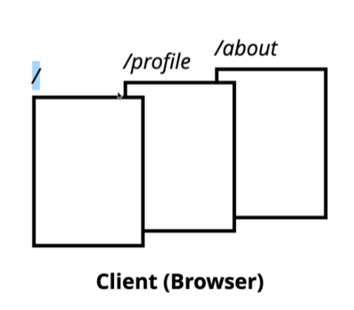

# :sunflower: React-study

:open_file_folder: ch1. React Getting Started

<details>
<summary> :pencil: 01. React Concept  </summary>
<div markdown="1">

## 01. React Concept

### :pushpin: React 란 무엇일까?

> React 는 사용자 인터페이스(User Interface)를 만들기 위한 Javascript 라이브러리이다. <br>
> React 를 이해하기 위해 DOM(Document Object Model)을 알아야한다. <br>
> DOM 은 자바스크립트에서 HTML에 접근할 수 있도록 요소들을 객체화하여 사용할 수 있도록 한다.<br>
> DOM은 HTML이나 XML 문서의 interface 이다.

### :pushpin: Virtual DOM

가상 DOM은 DOM이 생성되기 전, 이전 상태 값과 수정사항을 비교하여 달라진 부분만 DOM 에게 한번에 전달하여 한번만 렌더링을 진행한다.

### :pushpin: Why virtual DOM?

- DOM 을 직접 제어하는 경우
  - 바뀐 부분만 정확히 바꿔야 한다.
- DOM을 직접 제어하지 않는 경우
  - 가상의 돔 트리를 사용해서,
  - 이전 상태를 비교하여,
  - 바뀐 부분을 찾아내서 자동으로 바꾼다.

### :pushpin: 컴포넌트

- React는 UI를 여러 컴포넌트로 만들어 사용하므로 재사용성이 높다.
- 프로젝트가 복잡해지더라도 코드 유지보수 및 관리에 용이하다.
</div>
</details>

<details>
<summary> :pencil: 02. 개발 환경 체크  </summary>
<div markdown="1">

## 필요한 개발환경

- Node.js
  - installer
  - nvm
- Browser (Chrome)
- Git
- VSCode
</div>
</details>

<details>
<summary> :pencil: 03. React 라이브러리(1)  </summary>
<div markdown="1">

## 리액트가 하는 일

리액트의 핵심 모듈 2개로 리액트가 하는 일 알아보기

### :one: 리액트 컴포넌트 => HTMLElement 연결하기

"만들어진 리액트 컴포넌트"를 실제 HTMLElement에 연결할 때 ReactDOM 라이브러리를 이용한다.

```js
import ReactDOM from "react-dom";
```

### :two: 리액트 컴포넌트 만들기

```js
import React from "react";
```

## 파일 생성 예제

### :one: 프로젝트 시작하기

```
$ npm init -y
$ npx serve
```

### :two: index.html 파일 생성

[CDN 링크](https://reactjs.org/docs/cdn-links.html)
위 사이트에 접속하여 링크를 body 부분에 추가해준다

- index.html

```html
<body>
  <script
    crossorigin
    src="https://unpkg.com/react@18/umd/react.development.js"
  ></script>
  <script
    crossorigin
    src="https://unpkg.com/react-dom@18/umd/react-dom.development.js"
  ></script>
</body>
```

</div>
</details>

:open_file_folder: ch2. React Component

<details>
<summary> :pencil: React Component 만드는법  </summary>
<div markdown="1">

## React Component 만드는법 - 2가지

### class 컴포넌트

```js
import React from "react";

// 정의
class ClassComponent extends React.Component {
  render() {
    // 항상 return 해주어야 한다.
    return <div>Hello</div>;
  }
}

// 사용
ReactDom.render(<ClassComponent />, document.querySelector("#root"));
```

### function 컴포넌트

```js
import React from "react";

// 정의 1
function FunctionComponent() {
  return <div>Hello</div>;
}
// 사용
ReactDOM.render(<FunctionComponent />, document.querySelector("#root"));

// 정의 2
const FunctionComponent = () => <div>Hello</div>;

// 사용
ReactDOM.render(<FunctionComponent />, document.querySelector("#root"));
```

</div>
</details>

<details>
<summary> :pencil: React.createElemet  </summary>
<div markdown="1">

## React.createElemet

사용형태

```js
React.createElemet(
  type, // 태그 이름 문자열 | 리액트 컴포넌트 | React.Fragment
  [props], // 리액트 컴포넌트에 넣어주는 데이터 객체
  [...children] // 자식으로 넣어주는 요소들
);
```

:one: 태그 이름 문자열 type

```html
<div id="root"></div>
<script type="text/javascript">
  ReactDOM.render(
    React.createElement("h1", null, `type 이 "태그 이름 문자열" 입니다.`),
    document.querySelector("#root")
  );
</script>
```

:two: 리액트 컴포넌트 type

```html
<div id="root"></div>
<script type="text/javascript">
  const Component = () => {
    return React.createElement("p", null, `type이 "React 컴포넌트" 입니다.`);
  };

  // <Component></Component> => <Component /> => <p>type이 "React 컴포넌트" 입니다.</p>
  ReactDOM.render(
    React.createElement(Component, null, null),
    document.querySelector("#root")
  );
</script>
```

:three: React.Fragment

```html
<div id="root"></div>
<script type="text/javascript">
  ReactDOM.render(
    React.createElement(
      React.Fragment,
      null,
      `type 이 "React Fragment" 입니다.`
    ),
    document.querySelector("#root")
  );
</script>
```

</div>
</details>

<details>
<summary> :pencil: JSX  </summary>
<div markdown="1">

## JSX

복잡한 코드를 순수하게 실행할 수 있는 자바스크립트로 변환하는 과정이 필요하다.<br>
JSX 문법으로 작성된 코드는 순수한 JavaScript로 컴파일 하여 사용한다. <br>
이는 `babel` 에 의해 진행된다.
[babel 사이트](https://babeljs.io/)
아래의 코드를 추가해주면 자동으로 변환한다.

```html
<script src="https://unpkg.com/@babel/standalone/babel.min.js"></script>

<div id="root"></div>
<script type="text/babel">
  ReactDOM.render(
    <div>
      <div>
        <h1>주제</h1>
        <ul>
          <li>React</li>
          <li>Vue</li>
        </ul>
      </div>
    </div>,
    document.querySelector("#root")
  );
</script>
```

### JSX를 사용하는 이유

- React.createElement VS JSX
  - JSX가 가독성이 엄청 좋음
- babel 과 같은 컴파일 과정에서 문법적 오류를 인지하기 쉬움

### JSX 문법

- 최상위 요소가 하나여야 합니다.
- 최상위 요소 리턴하는 경우, () 로 감싸야 합니다.
- 자식들을 바로 랜더링하고 싶으면, <>자식들</>를 사용합니다. => Fragment
- 자바스크립트 표현식을 사용하려면, {표현식} 를 이용합니다.
- if 문은 사용할 수 없습니다.
  - 삼항 연산자 혹은 &&를 사용합니다.
- style 을 이용해 인라인 스타일링이 가능합니다.
- class 대신 className 을 사용해 class 를 적용할 수 있습니다.
</div>
</details>

<details>
<summary> :pencil: Props와 State  </summary>
<div markdown="1">

## Props와 State

- Props는 컴포넌트 외부에서 컴포넌트에게 주는 데이터 입니다.
- State 는 컴포넌트 내부에서 변경할 수 있는 데이터 입니다.
- 둗다 변경이 발생하면, 랜더가 다시 일어날 수 있습니다.

## Render 함수

Props 와 State 를 바탕으로 컴포넌트를 그립니다. <br>
그리고 Props와 state가 변경되면, 컴포넌트를 다시 그립니다. <br>
컴포넌트를 그리는 방법을 기술하는 함수가 랜더합수 입니다.


## Props

### :pushpin: 코드로 살펴보기

:one: function Component 이용하기

```html
<div id="root"></div>
<script type="text/babel">
  console.log(React);
  console.log(ReactDOM);

  // {message: '안녕하세요!!!'}
  function Component(props) {
    return (
      <div>
        <h1>{props.message} 이것은 함수로 만든 컴포넌트 입니다.</h1>
      </div>
    );
    // 출력: 안녕하세요!!! 이것은 함수로 만든 컴포넌트 입니다.
  }

  ReactDOM.render(
    <Component message="안녕하세요!!!" />,
    document.querySelector("#root")
  );
</script>
```

:two: class Component 이용하기

```html
<div id="root"></div>
<script type="text/babel">
  console.log(React);
  console.log(ReactDOM);

  class Component extends React.Component {
    render() {
      return (
        <div>
          <h1>{this.props.message} 이것은 클래스로 만든 컴포넌트 입니다.</h1>
        </div>
      );
    }
  }

  ReactDOM.render(
    <Component message="안녕하세요!!" />,
    document.querySelector("#root")
  );
</script>
```

- 기본값 지정해보기 1

```html
<div id="root"></div>
<script type="text/babel">
  console.log(React);
  console.log(ReactDOM);

  class Component extends React.Component {
    render() {
      return (
        <div>
          <h1>{this.props.message} 이것은 클래스로 만든 컴포넌트 입니다.</h1>
        </div>
      );
    }
  }

  Component.defaultProps = {
    message: "기본값",
  };

  ReactDOM.render(<Component />, document.querySelector("#root"));
</script>
```

- 기본값 지정해보기 2

```html
<div id="root"></div>
<script type="text/babel">
  console.log(React);
  console.log(ReactDOM);

  class Component extends React.Component {
    render() {
      return (
        <div>
          <h1>{this.props.message} 이것은 클래스로 만든 컴포넌트 입니다.</h1>
        </div>
      );
    }

    static defaultProps = {
      message: "기본값",
    };
  }

  ReactDOM.render(<Component />, document.querySelector("#root"));
</script>
```

함수에서도 사용 가능하다.

## State

- State 정의 방법 1: 항상 객체 형태로 선언해야함

```html
<div id="root"></div>
<script type="text/babel">
  console.log(React);
  console.log(ReactDOM);

  class Component extends React.Component {
    state = {
      count: 0,
    };
    render() {
      return (
        <div>
          <h1>{this.props.message} 이것은 클래스로 만든 컴포넌트 입니다.</h1>
          <p>{this.state.count}</p>
        </div>
      );
    }

    componentDidMount() {
      // 메서드 재정의
      setTimeout(() => {
        this.setState({
          count: this.state.count + 1,
        });
      }, 1000);
    }

    static defaultProps = {
      message: "기본값",
    };
  }

  ReactDOM.render(
    <Component message="기본값 아님" />,
    document.querySelector("#root")
  );
</script>
```

- State 정의 방법 2

```html
<div id="root"></div>
<script type="text/babel">
  console.log(React);
  console.log(ReactDOM);

  class Component extends React.Component {
    constructor(props) {
      super(props);

      // state 초기화
      this.state = { count: 0 };
    }

    render() {
      return (
        <div>
          <h1>{this.props.message} 이것은 클래스로 만든 컴포넌트 입니다.</h1>
          <p>{this.state.count}</p>
        </div>
      );
    }

    componentDidMount() {
      // 메서드 재정의
      setTimeout(() => {
        // this.setState({
        //     count: this.state.count + 1,
        // });
        this.setState((previousState) => {
          const newState = { count: previousState.count + 1 };
          return newState;
        });
      }, 1000);
    }

    static defaultProps = {
      message: "기본값",
    };
  }

  ReactDOM.render(
    <Component message="기본값 아님" />,
    document.querySelector("#root")
  );
</script>
```

</div>
</details>

<details>
<summary> :pencil: Event Handling  </summary>
<div markdown="1">

## Event Handling

- HTML DOM 에 클릭하면 이벤트가 발생하고, 발생하면 그에 맞는 병경이 일어나도록 해야합니다.
- JSX 에 이벤트를 설정할 수 있습니다.

```js
class Comp extends React.Component {
  render() {
    return (
      <div>
        <button
          onClick={() => {
            console.log("clicked");
          }}
        ></button>
      </div>
    );
  }
}
```

- camelCase 로만 사용할 수 있습니다.
  - onClick, onMouseEnter
- 이벤트에 연결된 자바스트립트 코드는 함수입니다.
  - 이벤트={함수} 와 같이 사용합니다.
- 실제 DOM 요소들에만 사용 가능합니다.
  - 리액트 컴포넌트에 사용하면, 그냥 props로 전달합니다.

### :pushpin: 코드 구현

- 함수로 구현

```html
<script type="text/babel">
  function Component() {
    return (
      <div>
        <button
          onClick={() => {
            console.log("clicked");
          }}
        >
          클릭
        </button>
      </div>
    );
  }

  ReactCOM.render(<Component />, document.querySelector("#root"));
</script>
```

- class로 구현

```html
<script type="text/babel">
  class Component extends React.Component {
    state = {
      count: 0,
    };
    render() {
      return (
        <div>
          <p>{this.state.count}</p>
          <button
            // onMouseEnter
            onClick={() => {
              console.log("clicked");
              this.setState((state) => ({
                ...state,
                count: state.count + 1,
              }));
            }}
          >
            클릭
          </button>
        </div>
      );
    }
  }

  ReactCOM.render(<Component />, document.querySelector("#root"));
</script>
```

- 위 코드 `method` 로 분리하기 1

```html
<script type="text/babel">
  class Component extends React.Component {
    state = {
      count: 0,
    };
    constructor(props) {
      super(props);

      this.click = this.click.bind(this);
    }
    render() {
      return (
        <div>
          <p>{this.state.count}</p>
          <button onClick={this.click}>클릭</button>
        </div>
      );
    }
    click() {
      console.log("clicked");
      this.setState((state) => ({
        ...state,
        count: state.count + 1,
      }));
    }
  }

  ReactCOM.render(<Component />, document.querySelector("#root"));
</script>
```

- 위 코드 `method` 로 분리하기 2

```html
<script type="text/babel">
  class Component extends React.Component {
    state = {
      count: 0,
    };
    render() {
      return (
        <div>
          <p>{this.state.count}</p>
          <button onClick={this.click}>클릭</button>
        </div>
      );
    }
    click = () => {
      console.log("clicked");
      this.setState((state) => ({
        ...state,
        count: state.count + 1,
      }));
    };
  }

  ReactCOM.render(<Component />, document.querySelector("#root"));
</script>
```

</div>
</details>

<details>
<summary> :pencil: Component Lifecycle  </summary>
<div markdown="1">

## Component Lifecycle

리액트 컴포넌트는 탄생부터 죽음까지 여러지점에서 개발자가 작업이 가능하도록 메서드를 오버라이딩 할 수 있게 해준다.

### :one: Component 생성 및 마운트

- constructor
- componentWillMount
- render(최초 렌더)
- componentDidMount

```html
<script type="text/babel">
  class App extends React.component {
    state = {
      age: 23,
    };
    constructor(props) {
      super(props);

      console.log("constructor", props);
    }
    render() {
      console.log("render");
      return (
        <div>
          <h2>
            Hello {this.props.name} - {this.state.age}
          </h2>
        </div>
      );
    }
    componentWillMount() {
      console.log("componentWillMount");
    }
    conmonentDidMount() {
      console.log("componentDidMount");

      setInterval(() => {
        console.log("setInterval");
        this.setState((state) => ({ ...state, age: state.age }));
      }, 1000);
    }
  }

  ReactDOM.render(<App name="Mark" />, document.querySelector("#root"));
</script>
```

### :two: Component props, state 변경

- componentWillReceiveProps
  - props 를 새로 지정했을 때 바로 호출됩니다.
  - 여기는 state 의 변경에 반응하지 않습니다.
    - 여기서 props 의 값에 따라 state 를 변경해야 한다면,
      - setState 를 이용해 state 를 변경합니다.
      - 그러면 다음 이벤트로 각각 가는 것이 아니라 한번에 변경됩니다.
- shouldComponentUpdate
  - props 만 변경되어도 실행됩니다.
  - state 만 변경되어도 실행됩니다.
  - props & state 둘다 변경되어도 실행됩니다.
  - newProps 와 new State 를 인자로 해서 호출합니다.
  - return type 이 boolean 입니다.
    - true 면 render
    - false 면 render 가 호출되지 않습니다.
    - 이 함수를 구현하지 않으면, 디폴트는 true 입니다.
- componentWillUpdate
  - 컴포넌트가 재 렌더링 되기 직접에 불립니다.
  - 여기선 setState 같은 것을 사용하면 안됩니다.
- <b>render</b>
- componentDidUpdate
  - 컴포넌트가 재 렌더링을 마치면 불립니다.

```html
<script type="text/babel">
  class App extends React.component {
    state = {
      age: 23,
    };
    interval = 0;
    constructor(props) {
      super(props);

      console.log("constructor", props);
    }
    render() {
      console.log("render");
      return (
        <div>
          <h2>
            Hello {this.props.name} - {this.state.age}
          </h2>
        </div>
      );
    }
    componentWillMount() {
      console.log("componentWillMount");
    }
    conmonentDidMount() {
      console.log("componentDidMount");

      this.interval = setInterval(() => {
        // console.log("setInterval");
        this.setState((state) => ({ ...state, age: state.age }));
      }, 1000);
    }
    componentWillReceiveProps() {
      console.log("componentWillReceiveProps", nextProps);
    }
    shouldComponentUpdate() {
      console.log("shouldComponentUpdate", nextProps, nextState);

      return true;

      // return 을 해주어야 한다.
      // return true; 함수가 끝나면 바로 render 할 준비를 한다.
      // return false; 다음 단계로 넘어가지 않기 때문에 render를 하지 않는다. 그러므로 false 를 해놓으면 효율적으로 render를 처리할 수 있다.
    }
    componentWillUpdate(nextProps, nextState) {
      console.log("componentWillUpdate", nextProps, nextState);
    }

    // render 가 시작
    componentDidUpdate(prevProps, prevState) {
      console.log("componentDidUpdate", prevProps, prevState);
    }

    componentWillUnmpunt() {
      clearInterval(this.interval);
    }
  }

  ReactDOM.render(<App name="Mark" />, document.querySelector("#root"));
</script>
```

### :three: Component 언마운트

- componentWillUnmpunt

</div>
</details>

<details>
<summary> :pencil: Component Lifecycle 변경 </summary>
<div markdown="1">

### :one: Component 생성 및 마운트

- construtcor
- ~~componentWillMound~~ => getDerivedStateFromProps
- render
- componentDidMount

### :two: Component props, state 변경

- ~~componentWillReceiveProps~~ => getDerivedStateFromProps
- shouldComponentUpdate
- render
- ~~componentWillUpdate~~ => getSnapshotBeforeUpdate
- componentDidUpdate

```html
<script type="text/babel">
  const i = 0;
  class Appp extends React.Component {
      state = { list: [] };

      render() {
          return (
              <div id="list" style={{height: 100, overflow: "scroll"}}>
                  {this.state.lsit.map((i) => {
                      return <div>{i}</div>
                  })}
              </div>
          );
      }

      componentDidMount() {
          setInterval(() => {
              this.setState((state) => ({
                  list: [..state.list, i++],
              }));
          }, 1000);
      }

      getSnapshotBeforUpdate(prevProps, prevState) {
          if(prevState.list.length === this.state.list.length) return null; // 차이가 있으면 저장할 필요 없음
          const list = document.querySelector('#list');
          return list.scrollHeight - list.scrollTop; // snap 샷으로 저장해줌
      }

      componentDidUpdate(prevProps, prevState, snapshot) {
          console.log(snapshot); // list.scrollHeight - list.scrollTop 결과값 출력
          if (snapshot === null) return;
          const list = document.querySelector('#list');
          list.scrollTop = list.scrollHeight - snapshot; // 마지막 내용이 업데이트 되면 스크롤이 자동으로 내려감
      }
  }

  ReactDOM.render(<App name="Mark" />, document.querySelector('#root'));
</script>
```

### :pushpin: component 에러 캐치

- componentDidCatch

```html
<script type="text/babel">
  const i = 0;
  class Appp extends React.Component {
    state = {
      hasError: false,
    };
    render() {
      if (this.state.hasError) {
        return <div>예상치 못한 에러가 발생했습니다.</div>;
      }
      return <WebService />;
    }

    // WebService 에서 에러가 발생하는 것을 알아차리는 곳
    componentDidCatch(error, info) {
      this.setState({ hasError: true });
    }
  }

  ReactDOM.render(<App name="Mark" />, document.querySelector("#root"));
</script>
```

</div>
</details>

:open_file_folder: ch3. Creating React Project : 실제 현업에서 사용하는 프로젝트 제작하기

<details>
<summary> :pencil: 01. Create React App  </summary>
<div markdown="1">

## 사이트 접속하기

[CRA](https://create-react-app.dev)

- Facebook 의 오픈소스 이다.
- React 도 facebook 에서 시작했다.
- 그러므로 공식적인 tool 이라고 봐도 무방하다.
  

## 명령어 살펴보기

### npx

npm 5.2.0 이상부터 함께 설치된 커맨드라인 명령어

## 프로젝트 시작하기

### :one: 프로젝트 만들기

- node 기반의 프로젝트를 생성한다.

```
npx create-react-app 프로젝트 이름
```

```
npx create-react-app tic-tac-toe
```

### :two: 프로젝트 접속

- 프로젝트 생성 후 사이트로 확인하면 기본 세팅된 페이지가 나온다.

```
npm start
```


### :three:

작업을 다 끝냈다면 최종적으로 배포할 준비를 해야한다.<br>

### npm start

- react-scripts start
- Starting the development server...

### npm run build

- react-scripts build
- Creacting an optimized production build...

```
npm run build
```

이 코드를 사용하면 컴파일을 실행하게 된다. <br>
컴파일 후 새로운 파일을 만들어 작은 파일로 관리한다.<br>
생성된 파일을 실행하려면 아래의 코드를 사용하면 된다.<br>

### npm install server -g

- server 라는 패키지를 전역으로 설치합니다.
- server 명령어를 -s 옵션으로 build 폴더를 지정하여 실행합니다.
  - -s 옵션은 어떤 라우팅으로 요청해도 index.html 을 응답하도록 합니다.

```
npm install server -g
server -s build
```

```
npx serve -s build
```

개발 모드와 똑같은 결과로 사이트에 출력될 것이다.<br>
다만, 코드가 간단하게 작성되어 있다는 차이점이 있다.<br>
개발할 때 코드를 수정하면 자동으로 build 가 수정된다.<br>

### npm test

- react-scripts test
- Jest 를 통해 test code 를 실햅합니다.

```
npm test
```

creact-react-app 을 사용하지 않기 위해서는 아래의 코드를 comand 창에 입력한다.<br>

### npm run eject

- react-scripts eject

```
npm run eject
```

eject 를 이용하면, cra 로 만든 프로젝트에서 cra를 제거한다. <br>
이는 돌이킬 수 없기 때문에 결정하기 전에 신중해야 한다.<br>
보통 cra 내에서 해결이 안되는 설정을 추가해야할 때 한다.

- react-scripts 는 사라집니다.
- 드러내지 않고 cra 에 의해 사용되던 각종 패키지가 package.json 에 나타난다.
- Jest, Babel, ESLint 설정이 추가된다.
- 각종 설정 파일이 config 폴더에 생성된다.
</div>
</details>

<details>
<summary> :pencil: 02. ESLint  </summary>
<div markdown="1">

## ESLint

creact app 으로 설치하면 기본적으로 설치된다. <br>
ESLint 는 react 프로젝트에서만 사용하는 것이 아니라 모든 js 프로젝트에서 사용된다.

## ESLint test

### :one: 기본 개념

```
$ mkdir eslint-test
$ cd .\eslint-test\
$ npm init -y
$ npm i eslint -D // 라이브러리 설치
$ npx eslint --init // 설치된 eslint 초기화
```

.eslintrc.js 파일이 생기는 것을 확인할 수 있다.

- "rules" 부분에 추가하고자 하는 내용을 추가한다.
- 홈페이지에 확인하면 더 많은 기능이 있다.

```js
module.exports = {
  env: {
    browser: true,
    es2021: true,
  },
  extends: "eslint:recommended",
  overrides: [],
  parserOptions: {
    ecmaVersion: "latest",
  },
  rules: {
    semi: ["error", "always"], // 세미콜론을 안찍으면 문제가 생김
  },
};
```

위의 코드를 적고 제대로 동작하는지 확인하려면 아래의 코드를 실행한다.

```
npx eslint index.js
```

오류가 발생했을 때 코드를 고치고 싶다면 아래의 명령어를 사용하면 된다.

```
npx eslint index.js --fix
```

### :two: create react 로 설치된 프로젝트에서의 사용법

### :pushpin: package.json

- .eslintrc.js 파일의 항목들이 아래의 코드로 작성되어 들어간다.

```json
  "eslintConfig": {
    "extends": [
      "react-app",
      "react-app/jest"
    ]
  },
```

내용을 추가하고 싶은 경우 rules 를 추가해주면 된다.

```json
  "eslintConfig": {
    "extends": [
      "react-app",
      "react-app/jest"
    ],
    "rules": {
        "semi": ["error", "always"],
    }
  },
```

</div>
</details>

<details>
<summary> :pencil: 03. Prettier  </summary>
<div markdown="1">

## Prettier

<b>An opinionated code formatter</b><br>
Prettier 에서 불필요하거나, Prettier 와 충돌할 수 있는 모든 규칙은 끈다. <br>
이 구성은 규칙을 끄기만 하기 때문에 다른 설정과 함께 사용하는 것이 좋다.

## Prettier test

```
$ mkdir prettier-test
$ cd .\prettier-test\
$ npm init -y
$ npm i prettier -D
```

### :pushpin: index.js

```js
console.log("Hello");
```

### :pushpin: cmd

- 코드가 잘못된 경우 올바른 코드를 알려준다.

```
npx prettier index.js
// 결과: console.log("Hello");
```

- 아래의 코드를 실행하면 자동으로 변환해준다.

```
npx prettier index.js --write
```

</div>
</details>

<details>
<summary> :pencil: 04. husky  </summary>
<div markdown="1">

## husky

- Git hooks made easy

## husky test

### cmd

```
$ mkdir husky-test
$ cd .\husky-test\
$ npm init -y
$ git init
$ npm i husky -D
$ npx husky install
```

### package.json

아래의 코드와 같이 수정하기

```json
{
  "name": "husky-test",
  "version": "1.0.0",
  "description": "",
  "main": "index.js",
  "scripts": {
    "prepare": "husky install",
    "test": "echo \"Error: no test specified\" && exit 1"
  },
  "keywords": [],
  "author": "",
  "license": "ISC",
  "devDependencies": {
    "husky": "^8.0.1"
  }
}
```

### cmd

```
$ npx husky add .husky/pre-commit "npm test"
```

이렇듯 husky 를 사용하면 commit 이 되기 직전에 모든 코드를 살펴볼 수 있다.

</div>
</details>

<details>
<summary> :pencil: 05. lint-staged - Run linters on git staged files </summary>
<div markdown="1">

## lint-staged

### cmd

```
$ cd tic-tac-toe/
$ npm i husky -D
$ npx husky install
```

### package.json

```json
    "scripts": {
        "prepare": "husky install",
        "start": "react-scripts start",
        "build": "react-scripts build",
        "test": "react-scripts test",
        "eject": "react-scripts eject"
    },
    "lint-staged": {
        "**/*.js": [
        "eslint --fix",
        "prettier --write",
        "git add"
        ]
    },
```

### cmd

```
$ npx husky add .husky/pre-commit "lint-staged"
$ npm i lint-staged -D
$ npm i prettier -D
```

</div>
</details>

<details>
<summary> :pencil: 06. Create React App 시작 코드 이해하기 </summary>
<div markdown="1">

[ReactDevelopTools 설치](https://chrome.google.com/webstore/detail/react-developer-tools/fmkadmapgofadopljbjfkapdkoienihi?hl=ko)

</div>
</details>

:open_file_folder: ch4. React Router

<details>
<summary> :pencil: 01. React 의 라우팅 이해하기 </summary>
<div markdown="1">

## SPA

### Single Page Application



- 서버로부터 전체를 받아온 후에 browser 에서 어떤걸 받아올지 결정한다.
- 서버로부터 각각의 페이지를 요청하는 것과 다르게 한번에 받아오고 url 에서 필요한 부분만 보여준다.

### SPA 라우팅 과정

1. 브라우저에서 최초에 '/' 경로로 요청하면,
2. React Web App 을 내려준다.
3. 내려받은 React App 에서 '/' 경로에 맞는 컴포넌트를 보여준다.
4. React App 에서 다른 페이지로 이동하는 동작을 수행하면,
5. 새로운 경로에 맞는 컴포넌트를 보여준다.

<br>
이러한 일을 해주는 패키지가 <b>react router</b>이다.

### 설치방법

```
npm i react-router-dom
```

- cra 에 기본 내장된 패키지가 아니다.
- react-router-dom 은 facebook 의 공시 패키지는 아니다.
- 가장 대표적인 라우팅 패키지이다.

### 프로젝트 시작하기

```
$ npx create-react-app react-router-example
$ cd react-router-example/
$ npm install react-router-dom
```

### src/App.js

```js
import { BrowserRouter, Route } from "react-router-dom";
import Home from "./pages/Home";
import Profile from "./pages/Profile";
import About from "./pages/About";

function App() {
  return (
    <BrowserRouter>
      <Route path="/" exact component={Home} />
      <Route path="/profile" component={Profile} />
      <Route path="/about" component={About} />
    </BrowserRouter>
  );
}

export default App;
```

- Route 컴포넌트에 경로(path) 와 컴포넌트(componet) 를 성정하여 나열해준다.
- BrowserRouter 로 Route 들을 감싸준다.
- 브라우저에서 요청한 경로에 Route 의 path 가 들어있으면 해당 component 를 보여준다.

### 에러가 발생하여 출력이 안 될 경우

<b>버전 수정하기</b>

```
npm install react-router-dom@5.3.0
```

</div>
</details>

<details>
<summary> :pencil: 02. Dynamic 라우팅 </summary>
<div markdown="1">

## Dynamic 라우팅

동적으로 처리하여 component 보여주기

### /scr/App.js

```js
import { BrowserRouter, Route } from "react-router-dom";
import Home from "./pages/Home";
import Profile from "./pages/Profile";
import About from "./pages/About";

function App() {
  return (
    <BrowserRouter>
      <Route path="/" exact component={Home} />
      <Route path="/profile" exact component={Profile} />
      <Route path="/profile/:id" component={Profile} />
      <Route path="/about" component={About} />
    </BrowserRouter>
  );
}

export default App;
```

### /src/Profile.jsx

```jsx
export default function Profile(props) {
  const id = props.match.params.id;
  console.log(id, typeof id);
  // typeof id = string
  return (
    <div>
      <h2>Profile 페이지입니다.</h2>
      {id && <p>id 는 {id} 입니다.</p>}
    </div>
  );
}
```

## ?key/value

### :one: 브라우저에 내장되어 있는 객체로 접근하기

#### About.js

```js
export default function About(props) {
  console.log(props);
  const searchParams = props.location.search;
  console.log(searchParams);
  const obj = new URLSearchParams(searchParams);
  console.log(obj.get("name"));
  return <div>About 페이지입니다.</div>;
}
```

### :two: 라이브러리 사용하기

#### comand

```
npm  i query-string
```

#### About.jsx

```jsx
import queryString from "query-string";

export default function About(props) {
  const searchParams = props.location.search;
  console.log(searchParams);
  const query = queryString.parse(searchParams);
  console.log(query);
  return (
    <div>
      <h2>About 페이지입니다.</h2>
      {query.name && <p>name 은 {query.name} 입니다.</p>}
    </div>
  );
}
```

</div>
</details>

<details>
<summary> :pencil: 03. Switch 와 NotFound </summary>
<div markdown="1">

## Switch

- 여러 Route 중 순서대로 먼저 맞는 하나만 보여준다.
- exact 를 뺄 수 있는 로직을 만들 수 있다.
- 가장 마지막에 어디 path 에도 맞지 않으면 보여지는 컴포넌트를 설정하여, "Not Found" 페이지를 만들 수 있다.

### App.js

```js
import { BrowserRouter, Route, Switch } from "react-router-dom";
import Home from "./pages/Home";
import Profile from "./pages/Profile";
import About from "./pages/About";
import NotFound from "./pages/NotFound.jsx";

function App() {
  return (
    <BrowserRouter>
      <Switch>
        <Route path="/profile/:id" component={Profile} />s
        <Route path="/profile" component={Profile} />
        <Route path="/about" component={About} />
        <Route path="/" exact component={Home} />
        <Route component={NotFound} />
      </Switch>
    </BrowserRouter>
  );
}

export default App;
```

### NotFound.jsx

```jsx
export default function NotFound() {
  return <div>페이지를 찾을 수 없습니다.</div>;
}
```

</div>
</details>

<details>
<summary> :pencil: 04. JSX 링크로 라우팅 이동하기 (1) </summary>
<div markdown="1">

# JSX 링크로 라우팅 이동하기

리액트 애플리케이션 내부에서 이동하는 벙법

## 원래 코드

```js
import { BrowserRouter, Route, Switch, Link } from "react-router-dom";
import Home from "./pages/Home";
import Profile from "./pages/Profile";
import About from "./pages/About";
import NotFound from "./pages/NotFound.jsx";

function App() {
  return (
    <BrowserRouter>
      <a href="/">Home</a>
      <Switch>
        <Route path="/profile/:id" component={Profile} />
        <Route path="/profile" component={Profile} />
        <Route path="/about" component={About} />
        <Route path="/" exact component={Home} />
        <Route component={NotFound} />
      </Switch>
    </BrowserRouter>
  );
}

export default App;
```

## Link 사용

- 새로고침 안함

```js
import { BrowserRouter, Route, Switch, Link } from "react-router-dom";
import Home from "./pages/Home";
import Profile from "./pages/Profile";
import About from "./pages/About";
import NotFound from "./pages/NotFound.jsx";

function App() {
  return (
    <BrowserRouter>
      <Link to="/">Home</Link>
      <Switch>
        <Route path="/profile/:id" component={Profile} />
        <Route path="/profile" component={Profile} />
        <Route path="/about" component={About} />
        <Route path="/" exact component={Home} />
        <Route component={NotFound} />
      </Switch>
    </BrowserRouter>
  );
}

export default App;
```

## Link 사용 - 안에서 여러 경로 이용

### src/App.js

```js
import { BrowserRouter, Route, Switch } from "react-router-dom";
import Home from "./pages/Home";
import Profile from "./pages/Profile";
import About from "./pages/About";
import NotFound from "./pages/NotFound";
import Links from "./components/Links";

function App() {
  return (
    <BrowserRouter>
      <Links />
      <Switch>
        <Route path="/profile/:id" component={Profile} />
        <Route path="/profile" component={Profile} />
        <Route path="/about" component={About} />
        <Route path="/" exact component={Home} />
        <Route component={NotFound} />
      </Switch>
    </BrowserRouter>
  );
}

export default App;
```

### src/components/Links.jsx

```jsx
import { Link } from "react-router-dom";

export default function Links() {
  return (
    <ul>
      <li>
        <Link to="/">Home</Link>
      </li>
      <li>
        <Link to="/profile">Profile</Link>
      </li>
      <li>
        <Link to="/profile/1">Profile/1</Link>
      </li>
      <li>
        <Link to="/about">About</Link>
      </li>
      {/* <li>
        <Link to="/about?name=mark">About?name=mark</Link>
      </li> */}
    </ul>
  );
}
```

</div>
</details>

<details>
<summary> :pencil: 05. NavLink 링크로 라우팅 이동하기 (2) </summary>
<div markdown="1">

## NavLink 링크로 라우팅 이동하기

- import {NavLink} from 'react-router-dom';
- activeClassName, activeStyle 처럼 active 상태에 대한 스타일 지정이 가능하다.
- Route 의 path 처럼 동작하기 때문에 exact 가 있다.

### src/App.js

```js
import { BrowserRouter, Route, Switch } from "react-router-dom";
import Home from "./pages/Home";
import Profile from "./pages/Profile";
import About from "./pages/About";
import NotFound from "./pages/NotFound";
import Links from "./components/Links";
import NavLinks from "./components/NavLinks";

function App() {
  return (
    <BrowserRouter>
      <Links />
      <NavLinks />
      <Switch>
        <Route path="/profile/:id" component={Profile} />
        <Route path="/profile" component={Profile} />
        <Route path="/about" component={About} />
        <Route path="/" exact component={Home} />
        <Route component={NotFound} />
      </Switch>
    </BrowserRouter>
  );
}

export default App;
```

### src/component/NavLinks.jsx

```jsx
import { NavLink } from "react-router-dom";

const activeStyle = { color: "green" };

export default function NavLinks() {
  return (
    <ul>
      <li>
        <NavLink to="/" exact activeStyle={activeStyle}>
          Home
        </NavLink>
      </li>
      <li>
        <NavLink to="/profile" exact activeStyle={activeStyle}>
          Profile
        </NavLink>
      </li>
      <li>
        <NavLink to="/profile/1" activeStyle={activeStyle}>
          Profile/1
        </NavLink>
      </li>
      <li>
        <NavLink
          to="/about"
          activeStyle={activeStyle}
          isActive={(match, location) => {
            console.log(location);
            return match !== null && location.search === "";
          }}
        >
          About
        </NavLink>
      </li>
      <li>
        <NavLink
          to="/about?name=mark"
          activeStyle={activeStyle}
          isActive={(match, location) => {
            console.log(location);
            return match !== null && location.search === "?name=mark";
          }}
        >
          About?name=mark
        </NavLink>
      </li>
    </ul>
  );
}
```

</div>
</details>

<details>
<summary> :pencil: 06. JS 로 라우팅 이동하기 </summary>
<div markdown="1">

## :one:

아래의 코드를 사용할 경우 하위에 함수가 있을 때 오류가 발생할 수 있다.

### App.js

```js
import { BrowserRouter, Route, Switch } from "react-router-dom";
import Home from "./pages/Home";
import Profile from "./pages/Profile";
import About from "./pages/About";
import NotFound from "./pages/NotFound";
import Links from "./components/Links";
import NavLinks from "./components/NavLinks";
import Login from "./pages/Login";

function App() {
  return (
    <BrowserRouter>
      <Links />
      <NavLinks />
      <Switch>
        <Route path="/login" component={Login} />
        <Route path="/profile/:id" component={Profile} />
        <Route path="/profile" component={Profile} />
        <Route path="/about" component={About} />
        <Route path="/" exact component={Home} />
        <Route component={NotFound} />
      </Switch>
    </BrowserRouter>
  );
}

export default App;
```

### Login.jsx

```jsx
import LoginButton from "../components/LoginButton";
export default function Login(props) {
  return (
    <div>
      <h2>Login 페이지 입니다.</h2>
      <LoginButton {...props} />
    </div>
  );
}
```

### LoginButton.jsx

```jsx
export default function LoginButton(props) {
  console.log(props);
  function login() {
    setTimeout(() => {
      props.history.push("/");
    }, 1000);
  }
  return <button onClick={login}>로그인하기</button>;
}
```

## :two: props 사용하지 않고 구현 - HOC 사용하기

위에서 발생하는 문제를 해결할 수 있다.

### Login.jsx

```jsx
import LoginButton from "../components/LoginButton";
export default function Login() {
  return (
    <div>
      <h2>Login 페이지 입니다.</h2>
      <LoginButton />
    </div>
  );
}
```

### LoginButton.jsx

```jsx
import { withRouter } from "react-router-dom";

export default withRouter(function LoginButton(props) {
  console.log(props);
  function login() {
    setTimeout(() => {
      props.history.push("/");
    }, 1000);
  }
  return <button onClick={login}>로그인하기</button>;
});
```

</div>
</details>

<details>
<summary> :pencil: 07. redirect </summary>
<div markdown="1">

## Redirect

```js
import { Redirect } from "react-router-dom";

// jsx
<Redirect to="" />;
```

## 코드로 살펴보기

### App.js

```js
import { BrowserRouter, Redirect, Route, Switch } from "react-router-dom";
import Home from "./pages/Home";
import Profile from "./pages/Profile";
import About from "./pages/About";
import NotFound from "./pages/NotFound";
import Links from "./components/Links";
import NavLinks from "./components/NavLinks";
import Login from "./pages/Login";

const isLogin = false;

function App() {
  return (
    <BrowserRouter>
      <Links />
      <NavLinks />
      <Switch>
        <Route
          path="/login"
          render={() => (isLogin ? <Redirect to="/" /> : <Login />)}
        />
        <Route path="/profile/:id" component={Profile} />
        <Route path="/profile" component={Profile} />
        <Route path="/about" component={About} />
        <Route path="/" exact component={Home} />
        <Route component={NotFound} />
      </Switch>
    </BrowserRouter>
  );
}

export default App;
```

</div>
</details>

:open_file_folder: ch5. React Component Styling

<details>
<summary> :pencil: 01. Style Loaders </summary>
<div markdown="1">

## Style Loaders

- babel config: 어떤 문법을 번역할건지 설정
- wepack: 파일 확장자에 맞는 loader 에게 위임

### 프로젝트 시작하기

```
$ npx create-react-app style-loaders-example
$ cd style-loaders-example/
```

### config/webpack.comfig.js 생성

```
$ npm run eject
```

## CSS (webpack.config.js)

```js
// "postcss" loader applies autoprefixer to our CSS.
// "css" loader resolves paths in CSS and adds assets as dependencies.
// "style" loader turns CSS into JS modules that inject <style> tags.
// In production, we use MiniCSSExtractPlugin to extract that CSS
// to a file, but in development "style" loader enables hot editing
// of CSS.
// By default we support CSS Modules with the extension .module.css
{
  test: cssRegex,
  exclude: cssModuleRegex,
  use: getStyleLoaders({
    importLoaders: 1,
    sourceMap: isEnvProduction
      ? shouldUseSourceMap
      : isEnvDevelopment,
    modules: {
      mode: 'icss',
    },
  }),
  // Don't consider CSS imports dead code even if the
  // containing package claims to have no side effects.
  // Remove this when webpack adds a warning or an error for this.
  // See https://github.com/webpack/webpack/issues/6571
  sideEffects: true,
},
```

<br>

```js
import "./App.css";
```

## CSS Module (webpack.config.js)

```js
// Adds support for CSS Modules (https://github.com/css-modules/css-modules)
// using the extension .module.css
{
  test: cssModuleRegex,
  use: getStyleLoaders({
    importLoaders: 1,
    sourceMap: isEnvProduction
      ? shouldUseSourceMap
      : isEnvDevelopment,
    modules: {
      mode: 'local',
      getLocalIdent: getCSSModuleLocalIdent,
    },
  }),
},
```

<br>

```js
import styles from "./App.modules.css";
```

## Sass (webpack.config.js)

```js
// Opt-in support for SASS (using .scss or .sass extensions).
// By default we support SASS Modules with the
// extensions .module.scss or .module.sass
{
  test: sassRegex,
  exclude: sassModuleRegex,
  use: getStyleLoaders(
    {
      importLoaders: 3,
      sourceMap: isEnvProduction
        ? shouldUseSourceMap
        : isEnvDevelopment,
      modules: {
        mode: 'icss',
      },
    },
    'sass-loader'
  ),
  // Don't consider CSS imports dead code even if the
  // containing package claims to have no side effects.
  // Remove this when webpack adds a warning or an error for this.
  // See https://github.com/webpack/webpack/issues/6571
  sideEffects: true,
},
```

<br>

```js
import "./App.scss";
import "./App.sass";
```

## Sass Module (webpack.config.js)

```js
// Adds support for CSS Modules, but using SASS
// using the extension .module.scss or .module.sass
{
  test: sassModuleRegex,
  use: getStyleLoaders(
    {
      importLoaders: 3,
      sourceMap: isEnvProduction
        ? shouldUseSourceMap
        : isEnvDevelopment,
      modules: {
        mode: 'local',
        getLocalIdent: getCSSModuleLocalIdent,
      },
    },
    'sass-loader'
  ),
},
```

<br>

```js
import styles from "./App.module.scss";
import styles from "./App.module.sass";
```

</div>
</details>

<details>
<summary> :pencil: 02. CSS, SASS </summary>
<div markdown="1">

## CSS, SASS

### App.css

```css
.App {
  text-align: center;
}

.App .logo {
  height: 40vmin;
  pointer-events: none;
}

@media (prefers-reduced-motion: no-preference) {
  .App .logo {
    animation: App-logo-spin infinite 20s linear;
  }
}

.App .header {
  background-color: #282c34;
  min-height: 100vh;
  display: flex;
  flex-direction: column;
  align-items: center;
  justify-content: center;
  font-size: calc(10px + 2vmin);
  color: white;
}

.App .link {
  color: #61dafb;
}

@keyframes App-logo-spin {
  from {
    transform: rotate(0deg);
  }
  to {
    transform: rotate(360deg);
  }
}
```

### App.scss

```scss
.App {
  text-align: center;

  .logo {
    height: 40vmin;
    pointer-events: none;
  }

  @media (prefers-reduced-motion: no-preference) {
    .logo {
      animation: App-logo-spin infinite 20s linear;
    }
  }

  .header {
    background-color: #282c34;
    min-height: 100vh;
    display: flex;
    flex-direction: column;
    align-items: center;
    justify-content: center;
    font-size: calc(10px + 2vmin);
    color: white;
  }

  .link {
    color: #61dafb;
  }

  @keyframes App-logo-spin {
    from {
      transform: rotate(0deg);
    }
    to {
      transform: rotate(360deg);
    }
  }
}
```

</div>
</details>

<details>
<summary> :pencil: 03. CSS module, SASS mobule </summary>
<div markdown="1">

## CSS module, SASS mobule

### ./App.module.css

- 실제 코드를 변환하여 스타일에 추가한다.
- 원래 클래스 이름에서 변경된 클래스 이름으로 import 한다.

## 분리된 형태로 사용하기

### src/App.js

```js
import logo from "./logo.svg";
// import "./App.css";
// import "./App.scss";
import styles from "./App.module.css";
import Button from "./components/Button";

// console.log(styles);
// {
//   App:"App_App__ukQSn"
//   App-logo-spin: "App_App-logo-spin__nRPNK"
//   header: "App_header__aHZhc"
//   link: "App_link__RirLq"
//   logo: "App_logo__J8xc0"
// }

function App() {
  return (
    <div className={[styles["App"]]}>
      <header className={[styles["header"]]}>
        
        <p>
          Edit <code>src/App.js</code> and save to reload.
        </p>
        <Button>Button</Button>
      </header>
    </div>
  );
}

export default App;
```

### Button.jsx

```jsx
import styles from "./Button.module.css";

const Button = (props) => <button className={styles["button"]} {...props} />;

export default Button;
```

### src/component/Button.module.css

```css
.button {
  background: transparent;
  border-radius: 3px;
  border: 2px solid palevioletred;
  color: palevioletred;
  margin: 0 1em;
  padding: 0.25em 1em;
  font-size: 20px;
}
```

## loading 추가

### Button.jsx

```jsx
import React from "react";
import styles from "./Button.module.css";

class Button extends React.Component {
  state = {
    loading: false,
  };
  render() {
    return (
      <button
        onClick={this.startLoading}
        className={
          this.state.loading
            ? `${styles["button"]} ${styles["loading"]}`
            : styles["button"]
        }
        {...this.props}
      />
    );
  }

  startLoading = () => {
    this.setState({
      loading: true,
    });
    setTimeout(() => {
      this.setState({
        loading: false,
      });
    }, 1000);
  };
}

export default Button;
```

### src/component/Button.module.css

```css
.button {
  background: transparent;
  border-radius: 3px;
  border: 2px solid palevioletred;
  color: palevioletred;
  margin: 0 1em;
  padding: 0.25em 1em;
  font-size: 20px;
}

.loading {
  border: 2px solid grey;
  color: grey;
}
```

## loading 추가 - classname 이용

### 개발 서버

```
npm i classnames
```

### classNames

```js
console.log(classNames("foo", "bar"));
console.log(classNames("foo", "bar", "baz"));

console.log(classNames({ foo: true }, { bar: false }));
console.log(classNames(null, false, "bar", undefined, 0, 1, { baz: null }, ""));
console.log(classNames(styles["button"], styles["loading"]));
```

### Button.jsx

```jsx
import React from "react";
import styles from "./Button.module.css";
import classNames from "classnames";

class Button extends React.Component {
  state = {
    loading: false,
  };
  render() {
    return (
      <button
        onClick={this.startLoading}
        className={classNames(styles["button"], {
          loading: this.state.loading,
        })}
        {...this.props}
      />
    );
  }

  startLoading = () => {
    this.setState({
      loading: true,
    });
    setTimeout(() => {
      this.setState({
        loading: false,
      });
    }, 1000);
  };
}

export default Button;
```

## loading 추가 - classname 이용 + bind 추가

### Button.jsx

```jsx
import React from "react";
import styles from "./Button.module.css";
import classNames from "classnames/bind";

const cx = classNames.bind(styles);

console.log(cx("button", "loading"));

class Button extends React.Component {
  state = {
    loading: false,
  };

  render() {
    const { loading } = this.state;

    return (
      <button
        onClick={this.startLoading}
        className={cx("button", { loading })}
        {...this.props}
      />
    );
  }

  startLoading = () => {
    this.setState({
      loading: true,
    });
    setTimeout(() => {
      this.setState({
        loading: false,
      });
    }, 1000);
  };
}

export default Button;
```

</div>
</details>

<details>
<summary> :pencil:  04. Styled Components (1) </summary>
<div markdown="1">

## Styled Components

```
$ npx create-react-app styled-components-example
$ cd styled-components-example/
$ npm i styled-components
```

### App.js

```js
import logo from "./logo.svg";
import "./App.css";
import StyledButton from "./components/StyledButton";

function App() {
  return (
    <div className="App">
      <header className="App-header">
        
        <p>
          <StyledButton>버튼</StyledButton>
        </p>
      </header>
    </div>
  );
}

export default App;
```

### StyledButton.jsx

```jsx
import styled from "styled-components";
const StyledButton = styled.button`
  background: transparent;
  border-radious: 3px;
  border: 2px solid palevioletred;
  color: palevioletred;
  margin: 0 1em;
  padding: 0.25em 1em;
  font-size: 20px;
`;

export default StyledButton;
```

</div>
</details>

<details>
<summary> :pencil:  05. Styled Components (2) </summary>
<div markdown="1">

## Styled Components

- 다른 스타일이 방해를 주지 않는다는 장점이 있다.
- 하지만 전역적으로 처리하기에는 어려움이 있다.

### App.js

```js
import logo from "./logo.svg";
import "./App.css";
import StyledButton from "./components/StyledButton";
import styled, { createGlobalStyle } from "styled-components";
import StyledA from "./components/StyledA";

const PrimaryStyledButton = styled(StyledButton)`
  background: palevioletred;
  color: white;
`;

const UppercaseButton = (props) => (
  <button {...props} children={props.children.toUpperCase()} />
);

const MyButton = (props) => (
  <button className={props.className} children={`MyButton ${props.children}`} />
);

const StyledMyButton = styled(MyButton)`
  background: transparent;
  border-radious: 3px;
  border: 2px solid ${(props) => props.color || "palevioletred"};
  color: ${(props) => props.color || "palevioletred"};
  margin: 0 1em;
  padding: 0.25em 1em;
  font-size: 20px;

  :hover {
    border: 2px solid red;
  }

  ::before {
    content: "@";
  }
`;

const GlobalStyle = createGlobalStyle`
button {
  color: yellow;
}
`;

function App() {
  return (
    <div className="App">
      <GlobalStyle />
      <header className="App-header">
        
        <p>
          <StyledButton>버튼</StyledButton>
          <StyledButton primary>버튼</StyledButton>
          <PrimaryStyledButton>버튼</PrimaryStyledButton>
          <StyledButton as="a" href="/">
            버튼
          </StyledButton>
          <StyledButton as={UppercaseButton}>button</StyledButton>
          <StyledMyButton color="green">button</StyledMyButton>
          <StyledA href="https://google.com">태그</StyledA>
        </p>
      </header>
    </div>
  );
}

export default App;
```

### StyledButton.jsx

```jsx
import styled, { css } from "styled-components";

const StyledButton = styled.button`
  background: transparent;
  border-radious: 3px;
  border: 2px solid palevioletred;
  color: palevioletred;
  margin: 0 1em;
  padding: 0.25em 1em;
  font-size: 20px;

  ${(props) =>
    props.primary &&
    css`
      background: palevioletred;
      color: white;
    `}
`;

export default StyledButton;
```

### StyledA.jsx

```jsx
import styled from "styled-components";
const StyledA = styled.a.attrs((props) => ({
  target: "_BLANK",
}))`
  color: ${(props) => props.color};
`;

export default StyledA;
```

</div>
</details>

<details>
<summary> :pencil:  06. React Shadow </summary>
<div markdown="1">

## 웹 컴포넌트

### 커스텀 앨리먼트

- Custom elements
- Shadow DOM: 충돌에 대한 걱정 없이 스크립트와 스타일을 작성할 수 있다.
- HTML, 탬플릿

## 프로젝트 시작

```
$ npx create-react-app react-shadow-example
$ cd react-shadow-example/
$ npm i react-shadow
```

</div>
</details>

<details>
<summary> :pencil:  07. andt Design </summary>
<div markdown="1">

## 프로젝트 시작

```
$ npx create-react-app antd-example
$ cd antd-example/
$ npm i antd
```

### :one: 전역 스타일 추가

- antd 가 css 를 포함하는 작업을 해줘야함

#### index.js

```js
import React from "react";
import ReactDOM from "react-dom/client";
import "antd/dist/antd.css"; // 전역 스타일 추가
import "./index.css";
import App from "./App";
import reportWebVitals from "./reportWebVitals";

const root = ReactDOM.createRoot(document.getElementById("root"));
root.render(
  <React.StrictMode>
    <App />
  </React.StrictMode>
);

// If you want to start measuring performance in your app, pass a function
// to log results (for example: reportWebVitals(console.log))
// or send to an analytics endpoint. Learn more: https://bit.ly/CRA-vitals
reportWebVitals();
```

### :two: antd 디자인 사용하기

#### App.js

```js
import logo from "./logo.svg";
import "./App.css";
import { Calendar } from "antd";

function App() {
  return (
    <div className="App">
      <header className="App-header">
        
        <p>
          <GithubOutlined />
        </p>
        <Calendar fullscreen={false} />
      </header>
    </div>
  );
}

export default App;
```

### :three: 아이콘 패키지 추가

#### console

```
$ npm install --save @ant-design/icons
```

#### App.js

```js
import logo from "./logo.svg";
import "./App.css";
import { Calendar } from "antd";
import { GithubOutlined } from "@ant-design/icons";

function App() {
  return (
    <div className="App">
      <header className="App-header">
        
        <p>
          <GithubOutlined />
        </p>
        <Calendar fullscreen={false} />
      </header>
    </div>
  );
}

export default App;
```

</div>
</details>

:open_file_folder: ch6. 리액트 실전 활용

<details>
<summary> :pencil:  01. High Order Component </summary>
<div markdown="1">

## HOC(Higher Order Component)

HOC는 function 과 같다.

```js
HOC = function{컴포넌트} { return 새로운 컴포넌트; }
```

HOC는 <컴포넌트>를 인자로 받아 <새로운 컴포넌트>를 리턴하는 함수
<br> 하지만 사용한 적이 있다.

### withRouter()

보통 with 가 붙은 함수가 HOC 인 경우가 많다.

```js
export default withRouter(LoginButton);
```

```js
import React from "react";
import { withRouter } from "react-router-dom";

cosnt LoginButton = props => {
  console.log(props);
  function login() {
    setTimeout(() => {
      props.history.push("/");
    }, 1000);
  }
  return <button onClick={login}>로그인하기</button>;
};

export default withRouter(LoginButton);
```

## 사용하는 법

- Use HOCs For Cross-Cutting Concerns
- Don't Mutate the Original Component. Use Composition
- Pass Unrelated Props Through to the Wrapped Component
- Maximizing Composability
- Wrap the Display Name for Easy Debugging

## 주의할 점

- Don't Use HOCs Inside the render Method
- Static Methods Must Be Copied Over
- Refs Aren't Passed Through (feat. React.forwardRef)

## github

hoist-non-react-statics

</div>
</details>

<details>
<summary> :pencil:  02. Controlled Component와 Uncontrolled Component </summary>
<div markdown="1">

## 상태를 가지고 있는 element

- input
- select
- textarea
- ...

## element 의 상태를 누가 관리하느냐에 따라

- 엘리먼트를 가지고 잇는 컴포넌트가 관리
  - controlled
- 엘리먼트의 상태를 관리하지 않고, 엘리먼트의 참조만 컴포넌트가 소유
  - [Uncontrolled](https://reactjs.org/docs/uncontrolled-components.html)

## Controlled Component

### ControlledComponent.jsx

```jsx
import React from "react";
class ControlledComponent extends React.Component {
  state = {
    value: "",
  };
  render() {
    const { value } = this.state;
    return (
      <div>
        <input value={value} onChange={this.change} />
        <button onClick={this.click}>전송</button>
      </div>
    );
  }
  change = (e) => {
    console.log(e.target.value);

    this.setState({ value: e.target.value });
  };
  click = () => {
    console.log(this.state.value);
  };
}

export default ControlledComponent;
```

### App.js

```js
import logo from "./logo.svg";
import "./App.css";
import ControlledComponent from "./components/ControlledComponent";

function App() {
  return (
    <div className="App">
      <header className="App-header">
        
        <ControlledComponent />
      </header>
    </div>
  );
}

export default App;
```

## Uncontrolled Component

### App.js

```js
import logo from "./logo.svg";
import "./App.css";
import ControlledComponent from "./components/ControlledComponent";
import UncontrolledComponent from "./components/UncontrolledComponent";

function App() {
  return (
    <div className="App">
      <header className="App-header">
        
        <ControlledComponent />
        <UncontrolledComponent />
      </header>
    </div>
  );
}

export default App;
```

### UncontrolledComponent.jsx

```jsx
import React from "react";

class UncontrolledComponent extends React.Component {
  render() {
    return (
      <div>
        <input id="my-input" />
        <button onClick={this.click}>전송</button>
      </div>
    );
  }

  click = () => {
    // input 엘리먼트의 현재 상태 값을 꺼내서 전송한다.
    const input = document.querySelector("#my-input");
    console.log(input.value);
  };
}

export default UncontrolledComponent;
```

위 코드의 방법은 지양한다. 그러므로 아래의 코드를 사용하는 것이 좋다.

### UncontrolledComponent.jsx

```jsx
import React from "react";

class UncontrolledComponent extends React.Component {
  inputRef = React.createRef();

  render() {
    console.log("initial render", this.inputRef);
    return (
      <div>
        <input ref={this.inputRef} />
        <button onClick={this.click}>전송</button>
      </div>
    );
  }

  componentDidMount() {
    console.log("componentDidMout", this.inputRef);
  }

  click = () => {
    // input 엘리먼트의 현재 상태 값을 꺼내서 전송한다.
    // const input = document.querySelector("#my-input");
    // console.log(input.value);
    console.log(this.inputRef.current.value);
  };
}

export default UncontrolledComponent;
```

상황에 따라 다르게 사용하여야 한다.

</div>
</details>

:open_file_folder: ch7. Hooks & Content

<details>
<summary> :pencil: 01. Basic Hooks </summary>
<div markdown="1">

## Basic Hooks

- useState
  - state 를 대체 할 수 있다.
- useEffect
  - 라이프 사이클 훅을 대체할 수 잇다.
    - componentDidMount
    - componentDidUpdate
    - componentWillUnmount
- useContext (Content API 에서 자세히... )

## Hooks 에 대해

[Hooks에 대한 내용](https://reactjs.org/docs/hooks-intro.html)

- react hook 은 내부에 설정 되어 있으므로 따로 설치하지 않아도 된다.

### App.js

### Example1.jsx

```jsx
import React from "react";

export default class Example1 extends React.Component {
  state = { count: 0 };

  render() {
    const { count } = this.state;

    return (
      <div>
        <p>Example1: You clicked {count} times !!!</p>
        <button onClick={this.click}>Click me</button>
      </div>
    );
  }

  click = () => {
    this.setState({ count: this.state.count + 1 });
  };
}
```

### Example2.jsx

```jsx
import React from "react";

export default function Example2() {
  const [count, setCount] = React.useState(0); // 배열형태
  return (
    <div>
      <p>Example2: You clicked {count} times !!!</p>
      <button onClick={click}>Click me</button>
    </div>
  );

  function click() {
    setCount(count + 1);
  }
}
```

### Example3.jsx

```jsx
import React from "react";

// useState => count
// useState => { count:0 };
export default function Example3() {
  const [state, setState] = React.useState({ count: 0 });
  return (
    <div>
      <p>Example3: You clicked {state.count} times !!!</p>
      <button onClick={click}>Click me</button>
    </div>
  );

  function click() {
    // setState({ count: state.count + 1 });
    setState((state) => {
      return {
        count: state.count + 1,
      };
    });
  }
}
```

### Example4.jsx

```jsx
import React from "react";

export default class Example4 extends React.Component {
  state = { count: 0 };

  render() {
    const { count } = this.state;

    return (
      <div>
        <p>Example4: You clicked {count} times !!!</p>
        <button onClick={this.click}>Click me</button>
      </div>
    );
  }

  // 최초 렌더가 발생한 직후에 componentDidMount
  componentDidMount() {
    console.log("componentDidMount", this.state.count);
  }

  componentDidUpdate() {
    console.log("componentDidUpdate", this.state.count);
  }

  click = () => {
    this.setState({ count: this.state.count + 1 });
  };
}
```

### Example5.jsx

```jsx
import React from "react";

export default function Example5() {
  const [count, setCount] = React.useState(0); // 배열형태

  // 항상 실행
  //   React.useEffect(() => {
  //     console.log("componentDidMount & componentDidUpdate", count);
  //   });

  // 최초에만 실행
  React.useEffect(() => {
    // render 가 된 직후
    console.log("componentDidMount");

    return () => {
      // cleanup
      // ComponentWillUnmount
    };
  }, []);

  React.useEffect(() => {
    console.log("componentDidMount & componentDidUpdate by count", count);
    return () => {
      // cleanup
      console.log("cleanup by count", count);
    };
  }, [count]);

  return (
    <div>
      <p>Example5: You clicked {count} times !!!</p>
      <button onClick={click}>Click me</button>
    </div>
  );

  function click() {
    setCount(count + 1);
  }
}
```

</div>
</details>

<details>
<summary> :pencil: 02. Custom Hooks </summary>
<div markdown="1">

## Custom Hooks

나만의 Hokks 을 만들어보기

- hook의 특징은 hook 또는 함수 안에서만 실행이 가능하다.

## 브라우저의 가로창이 변경되었을 때 숫자 받아오기

- src/hooks/useWindowWidth.js 만들기

```js
import React, { useEffect } from "react";

export default function useWindowWidth() {
  // 초기값은 최초의 가로창
  const [width, setWidth] = React.useState(window.innerWidth);

  useEffect(() => {
    const resize = () => {
      setWidth(window.innerWidth);
    };

    window.addEventListener("resize", resize);

    // 사용 안할 때는 해지
    // clean up
    return () => {
      window.removeEventListener("resize", resize);
    };
  });

  return width;
}
```

### App.js

```js
import logo from "./logo.svg";
import "./App.css";
import Example1 from "./components/Example1";
import Example2 from "./components/Example2";
import Example3 from "./components/Example3";
import Example4 from "./components/Example4";
import Example5 from "./components/Example5";
import useWindowWidth from "./hooks/useWindowWidth";

function App() {
  const width = useWindowWidth();

  return (
    <div className="App">
      <header className="App-header">
        
        {/* <Example1 />
        <Example2 />
        <Example3 />
        <Example4 /> */}
        <Example5 />
        {width} {/*현재 브라우저의 초기값*/}
      </header>
    </div>
  );
}

export default App;
```

## 최초에 설정되고 최후에 사라지도록 하기

### useWindowWidth.js

```js
import { useState, useEffect } from "react";

export default function useWindowWidth() {
  // 초기값은 최초의 가로창
  const [width, setWidth] = useState(window.innerWidth);

  useEffect(() => {
    const resize = () => {
      setWidth(window.innerWidth);
    };

    window.addEventListener("resize", resize);

    // 사용 안할 때는 해지
    // clean up
    return () => {
      window.removeEventListener("resize", resize);
    };
  }, []);

  return width;
}
```

### App.js

```js
import logo from "./logo.svg";
import "./App.css";
import Example1 from "./components/Example1";
import Example2 from "./components/Example2";
import Example3 from "./components/Example3";
import Example4 from "./components/Example4";
import Example5 from "./components/Example5";
import useWindowWidth from "./hooks/useWindowWidth";

function App() {
  const width = useWindowWidth();

  return (
    <div className="App">
      <header className="App-header">
        
        {/* <Example1 />
        <Example2 />
        <Example3 />
        <Example4 /> */}
        <Example5 />
        {width} {/*현재 브라우저의 초기값*/}
      </header>
    </div>
  );
}

export default App;
```

## useHaseMounted us withHasMounted

### src/hooks/useHasMounded.js

```js
import { useEffect, useState } from "react";

export default function useHaseMounted() {
  const [hasMounted, setHasMounted] = useState(false);

  useEffect(() => {
    setHasMounted(true);
  }, []);

  return hasMounted;
}
```

### App.js

```js
import logo from "./logo.svg";
import "./App.css";
import useWindowWidth from "./hooks/useWindowWidth";
import withHasMounted from "./hocs/withHasMounted";
import useHaseMounted from "./hooks/useHasMounted";

function App({ hasMounted }) {
  const width = useWindowWidth();
  const hasMountedFromHooks = useHaseMounted();

  console.log(hasMounted, hasMountedFromHooks);

  return (
    <div className="App">
      <header className="App-header">
        
        {width} {/*현재 브라우저의 초기값*/}
      </header>
    </div>
  );
}

export default withHasMounted(App);
```

### src/hocs/withHasMounted.jsx

```jsx
import React from "react";

export default function withHasMounted(Component) {
  class NewComponent extends React.Component {
    state = {
      hasMounted: false,
    };
    render() {
      const { hasMounted } = this.state;
      return <Component {...this.props} hasMounted={hasMounted} />;
    }
    // 렌더가 된 지후 실행
    componentDidMount() {
      this.setState({ hasMounted: true });
    }
  }

  NewComponent.displayName = `withHasMounted(${Component.name})`;

  return NewComponent;
}
```

### App.js

```js
import logo from "./logo.svg";
import "./App.css";
import useWindowWidth from "./hooks/useWindowWidth";
import withHasMounted from "./hocs/withHasMounted";

function App({ hasMounted }) {
  const width = useWindowWidth();

  console.log(hasMounted);

  return (
    <div className="App">
      <header className="App-header">
        
        {width} {/*현재 브라우저의 초기값*/}
      </header>
    </div>
  );
}

export default withHasMounted(App);
```

</div>
</details>

<details>
<summary> :pencil: 03. Additional Hooks </summary>
<div markdown="1">

## useReducer

- 다수의 하윗값을 포함하는 복잡한 정적 로직을 만드는 경우
- 다음 state 가 이전 state 에 의존적인 경우
- Redux를 안다면 쉽게 사용 가능

### Example6.jsx

```jsx
import { useReducer } from "react";

// reducer => state 를 변경하는 로직이 담겨 있는 함수
const reducer = (state, action) => {
  if (action.type === "PLUS") {
    return {
      count: state.count + 1,
    };
  }
  return state;
};

// dispatch => action 객체를 넣어서 실행

// action => 객체이고 필수 프로퍼티로 type을 가진다.

export default function Example6() {
  const [state, dispatch] = useReducer(reducer, { count: 0 });

  return (
    <div>
      <p>You clicked {state.count} thimes</p>
      <button onClick={click}>Click me</button>
    </div>
  );

  function click() {
    dispatch({ type: "PLUS" });
  }
}
```

### Example7.jsx

```jsx
import { useCallback, useMemo, useState } from "react";

function sum(persons) {
  console.log("sum...");
  return persons.map((person) => person.age).reduce((l, r) => l + r, 0);
}

export default function Example7() {
  const [value, setValue] = useState("");
  const [persons] = useState([
    { name: "MArk", age: 39 },
    { name: "Hanna", age: 28 },
  ]);

  const count = useMemo(() => {
    return sum(persons);
  }, [persons]);

  const click = useCallback(() => {
    console.log(value);
  }, []); // 최초에만 함수가 생성되도록

  return (
    <div>
      <input value={value} onChange={change} />
      <p>{count}</p>
      <button onClick={click}>click</button>
    </div>
  );
  function change(e) {
    setValue(e.target.value);
  }
}
```

## creactRef, useRef

### Example8.jsx

```jsx
import { createRef, useRef, useState } from "react";

export default function Example8() {
  const [value, setValue] = useState("");
  const input1Ref = createRef();
  const input2Ref = useRef();

  console.log(input1Ref.current, input2Ref.current);

  return (
    <div>
      <input value={value} onChange={change} />
      <input ref={input1Ref} />
      <input ref={input2Ref} />
    </div>
  );
  function change(e) {
    setValue(e.target.value);
  }
}
```

</div>
</details>

<details>
<summary> :pencil: 04. React Router Hooks </summary>
<div markdown="1">

### react-router-example/src/components/LoginButtn.jsx

원래 작성한 코드

- WithRouter 을 이용하여 props 를 전달

```jsx
import { withRouter } from "react-router-dom";

export default withRouter(function LoginButton(props) {
  console.log(props);
  function login() {
    setTimeout(() => {
      props.history.push("/");
    }, 1000);
  }
  return <button onClick={login}>로그인하기</button>;
});
```

이 코드를 아래와 같이 변경하면 props 로 들어오지 않기 때문에 에러가 난다.

```jsx
import { withRouter } from "react-router-dom";

export default function LoginButton(props) {
  console.log(props);
  function login() {
    setTimeout(() => {
      props.history.push("/");
    }, 1000);
  }
  return <button onClick={login}>로그인하기</button>;
}
```

아래와 같이 변경하면 오류를 없앨 수 있다.

- history 사용하기

```jsx
import { useHistory } from "react-router-dom";

export default function LoginButton(props) {
  const history = useHistory();
  console.log(props);
  function login() {
    setTimeout(() => {
      history.push("/");
    }, 1000);
  }
  return <button onClick={login}>로그인하기</button>;
}
```

### react-router-example/src/pages/Profile.jsx

- porps 대신 hook을 이용하여 구현하기

```jsx
import { useParams } from "react-router";

export default function Profile() {
  const params = useParams();
  const id = params.id;
  console.log(id, typeof id);
  return (
    <div>
      <h2>Profile 페이지입니다.</h2>
      {id && <p>id 는 {id} 입니다.</p>}
    </div>
  );
}
```

</div>
</details>

<details>
<summary> :pencil: 05. 컴포넌트 간 통신 </summary>
<div markdown="1">

## 하위 컴포넌트 변경하기

A 의 button 를 클릭하여 E 를 변경하려면

1. `<A />` 컴포넌트에서 button 에 onClick 이벤트를 만들고,
2. button 을 클릭하면, `<A />`의 state 를 변경하여, `<B />` 로 내려주는 props를 변경
3. `<B />` 의 props 가 변경되면, `<C />` 의 props 에 전달
4. `<C />` 의 props 가 변경되면, `<D />` 의 props로 전달
5. `<D />` 의 props 가 변경되면, `<E />` 의 props 로 전달

```jsx
import { useState } from "react";

export default function A() {
  const [value, setValue] = useState("아직 안바뀜");
  return (
    <div>
      <B value={value} />
      <button onClick={click}>E 의 값을 바꾸기</button>
    </div>
  );
  function click() {
    setValue("E 의 값을 변경");
  }
}

function B({ value }) {
  return (
    <div>
      <p>여긴 B</p>
      <C value={value} />
    </div>
  );
}
function C({ value }) {
  return (
    <div>
      <p>여긴 C</p>
      <D value={value} />
    </div>
  );
}
function D({ value }) {
  return (
    <div>
      <p>여긴 D</p>
      <E value={value} />
    </div>
  );
}
function E({ value }) {
  return (
    <div>
      <p>여긴 E</p>
      <h3>{value}</h3>
    </div>
  );
}
```

## 상위 컴포넌트를 변경하기

E 의 button 를 클릭하여 A 의 p 를 변경하려면

1. `<A />` 에 함수를 만들고, 그 함수 안에 state 를 변경하도록 구현, 그 변경으로 인해 p 안의 내용을 변경
2. 만들어진 함수를 props 에 넣어서 `<B />` 로 전달
3. `<B />` 의 props 의 함수를 `<C />` 의 props 로 전달
4. `<C />` 의 props 의 함수를 `<D /> `의 props 로 전달
5. `<D />` 의 props 의 함수를 `<E />` 의 props 로 전달, `<E />` 에서 클릭하면 props 로 받은 함수를 실행

```jsx
export default function A() {
  const [value, setValue] = useState("아직 안바뀜");
  return (
    <div>
      <p>{value}</p>
      <B setValue={setValue} />
    </div>
  );
}
function B({ setValue }) {
  return (
    <div>
      <p>여긴 B</p>
      <C setValue={setValue} />
    </div>
  );
}
function C({ setValue }) {
  return (
    <div>
      <p>여긴 C</p>
      <D setValue={setValue} />
    </div>
  );
}
function D({ setValue }) {
  return (
    <div>
      <p>여긴 D</p>
      <E setValue={setValue} />
    </div>
  );
}
function E({ setValue }) {
  return (
    <div>
      <p>여긴 E</p>
      <button onClick={click}>클릭</button>
    </div>
  );

  function click() {
    setValue("A 의 값을 변경");
  }
}
```

</div>
</details>

<details>
<summary> :pencil: 06. Context API </summary>
<div markdown="1">

Context API는 리액트에 내장되어 있으므로 따로 설치할 필요가 없다.

## 하위 컴포넌트 전체에 데이터를 공유하는 법

- 데이터를 set 하는 놈
  - 가장 상위 컴포넌트 => 프로바이더
- 데이터를 get 하는 놈
  - 모든 하위 컴포넌트에서 접근 가능
    - 컴슈머로 하는 방법
    - 클래스 컴포넌트의 this.context 로 하는 방법
    - 핑셔널 컴포넌트의 useContext 로 하는 방법

## 데이터를 Set 하기

1. 일단 컨텍스트를 생성한다.
2. 컨텍스트.프로바이더를 사용한다.
3. value 를 사용

### index.js

```js
import React from "react";
import ReactDOM from "react-dom/client";
import "./index.css";
import App from "./App";
import reportWebVitals from "./reportWebVitals";
import PersonContext from "./contexts/PersonContext";

const persons = [
  { id: 0, name: "Mark", age: 39 },
  { id: 1, name: "Hanna", age: 29 },
];

const root = ReactDOM.createRoot(document.getElementById("root"));
root.render(
  <React.StrictMode>
    <PersonContext.Provider value={persons}>
      <App />
    </PersonContext.Provider>
  </React.StrictMode>
);

reportWebVitals();
```

### PersonContext.js

```js
import React from "react";

const PersonContext = React.createContext();

export default PersonContext;
```

## 데이터를 Get 하기(1) - Consumer

1. 컨텍스트를 가져온다.
2. 컨텍스트.컨슈머를 사용한다.
3. value 를 사용

### example1.js

```js
import PersonContext from "../contexts/PersonContext";

export default function Example1() {
  return (
    <PersonContext.Consumer>
      {(persons) => (
        <ul>
          {persons.map((person) => (
            <li>{person.name}</li>
          ))}
        </ul>
      )}
    </PersonContext.Consumer>
  );
}
```

## 데이터를 Get 하기 (2) - class

1. static contextType 에 컨텍스트를 설정한다.
2. this.context => value 이다.

### Example2.jsx

```jsx
import React from "react";
import PersonContext from "../contexts/PersonContext";

export default class Example2 extends React.Component {
  static contextType = PersonContext;
  // 1개만 지정할 수 있다는 단점이 있음

  render() {
    const persons = this.context;
    return (
      <ul>
        {persons.map((person) => (
          <li>{person.name}</li>
        ))}
      </ul>
    );
  }
}

// Example2.contextType = PersonContext;
```

## 데이터를 Get 하기 (3) - functional

1. useContext 로 컨텍스트를 인자로 호출
2. useContext 의 리턴이 value 이다.

### Example3.jsx

```jsx
import { useContext } from "react";
import PersonContext from "../contexts/PersonContext";

export default function Example3() {
  const persons = useContext(PersonContext);
  return (
    <ul>
      {persons.map((person) => (
        <li>{person.name}</li>
      ))}
    </ul>
  );
}
```

</div>
</details>

:open_file_folder: ch8. React Testing

<details>
<summary> :pencil: 01. Javascript Unit Test & Jest 사용하기  </summary>
<div markdown="1">

## Test 프레임 워크

Jest

## facebook/jest

- 리액트의 영향이 크겠지만 가장 핫한 테스트 도구
- Easy shouldComponentUpdate
- Instant Feedback
  - 고친 파일만 빠르게 테스트 다시 해주는 기능 등
- Snapshot Testing
  - 컴포넌트 테스트에 중요한 역할을 하는 스냅샷

## 프로젝트 시작하기

```
$ npm init -y
$ npm i jest -D
```

### 항상 test 가 켜진 상태로 확인

```
$ npx jest --watchAll
```

### package.json

```json
{
  "name": "jest-example",
  "version": "1.0.0",
  "description": "",
  "main": "index.js",
  "scripts": {
    "test": "jest"
  },
  "keywords": [],
  "author": "",
  "license": "ISC",
  "devDependencies": {
    "jest": "^29.0.3"
  }
}
```

### example.test.js

```js
describe("expect test", () => {
  it("37 to equal 37", () => {
    expect(37).toBe(37);
  });
  it("{age: 39} to equal {age: 39}", () => {
    expect({ age: 39 }).toEqual({ age: 39 });
  });
  it(".toHaveLength", () => {
    expect("hello").toHaveLength(5); // 문자열 길이 테스트
  });
  it(".toHaveProperty", () => {
    expect({ name: "Mark" }).toHaveProperty("name");
    expect({ name: "Mark" }).toHaveProperty("name", "Mark");
  });
  it(".toBeDefined", () => {
    expect({ name: "Mark" }.name).toBeDefined();
  });
  it(".toBeFalsy", () => {
    expect(false).toBeFalsy();
    expect(0).toBeFalsy();
    expect("").toBeFalsy();
    expect(null).toBeFalsy();
    expect(undefined).toBeFalsy();
    expect(NaN).toBeFalsy();
  });
  it(".toBeGreaterThan", () => {
    expect(10).toBeGreaterThan(10);
  });
  it(".toBeGreaterThanOrEqual", () => {
    expect(10).toBeGreaterThanOrEqual(10);
  });
  it(".toBeInstanceOf", () => {
    class Foo {}
    expect(new Foo()).toBeInstanceOf(Foo);
  });
});
```

</div>
<details>

<details>
<summary> :pencil: 03. Testing-libraryReact 활용하기  </summary>
<div markdown="1">

## Button 컴포넌트

- 컴포넌트가 정상적으로 생성된다.
- "button" 이라고 쓰여있는 element 는 HTMLButtonElement 이다.
- 버튼을 클릭하면, p 태그 안에 "버튼이 방금 눌렸다." 라고 쓰여진다.
- 버튼을 클릭하기 전에는, p 태그 안에 "버튼이 눌리지 않았다" 라고 쓰여진다.
- 버튼을 클릭하고 5초 뒤에는, p 태그 안에 "버튼이 눌리지 않았다." 라고 쓰여진다.
- 버튼을 클릭하면, 5초 동안 버튼이 비활성화 된다.
</div>
<details>

:open_file_folder: ch9. React Advanced

<details>
<summary> :pencil: 01. Optimizing performance  </summary>
<div markdown="1">

## Optimizing performance

필요할 때만 렌더 한다.

</div>
<details>
